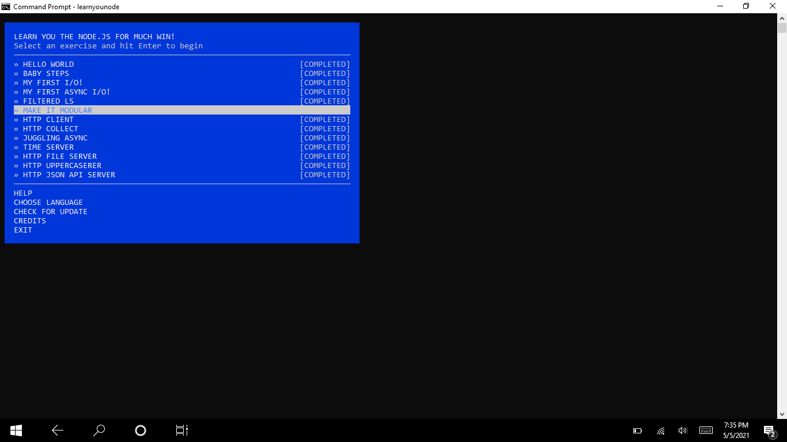
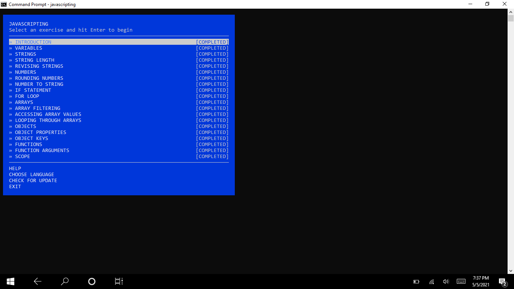

Using NPM global downloaded learnyouhtml learnyounode and javscripting. Worked through three workshops in full completion. Took screenshots of three completion screens then used github repo to save within my own directory.

