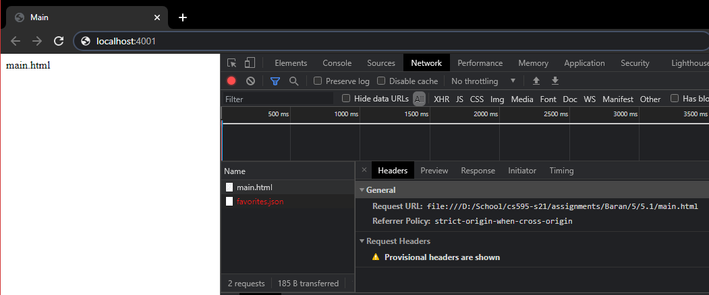
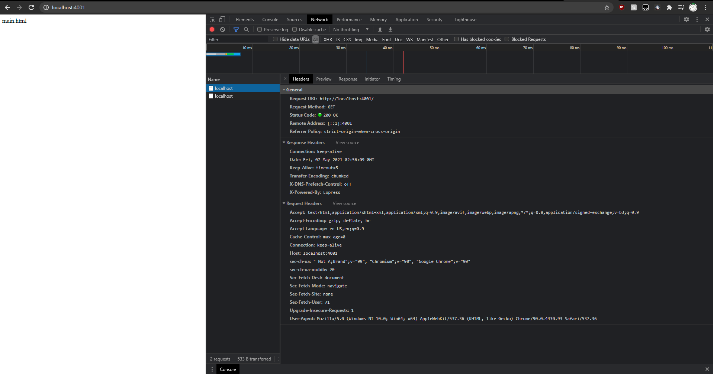
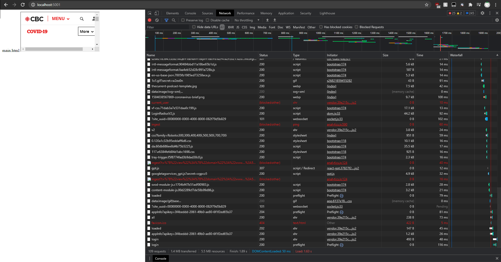

Assignment 5:

YT Video: https://youtu.be/TRNmuCnr_UM

Files:

/5.1

favorites.json:
    json file containing my 3 favorite things from assignment 1.
    
main.html:
    my html page that implements my json file.

server.js:
    node server hosting main.html.
    
server-success.js:
    js file that implements the CORS headers, allowing access.
    
server-failure.js:
    js file that does not implement the CORS headers, preventing access.
    

/5.2

main.html:
    html file attempting to print response headers.
    
server.js:
    node server hosting main.html.
    
server-success.js:
    js file that sets the Access-Control-Expose-Headers to *, allowing them to be accessed.
    
server-failure.js:
    js file that does not set the Access-Control-Expose-Headers to *, not allowing them to be accessed.
    

/5.3

main.html:
    html file that is iframing https://www.cbc.ca/
    
server-success.js:
    sets the Content-Security-Policy header fields to "self", allowing embedding.
    
server-success.js:
    does not set the Content-Security-Policy header fields to "self", not allowing embedding.
