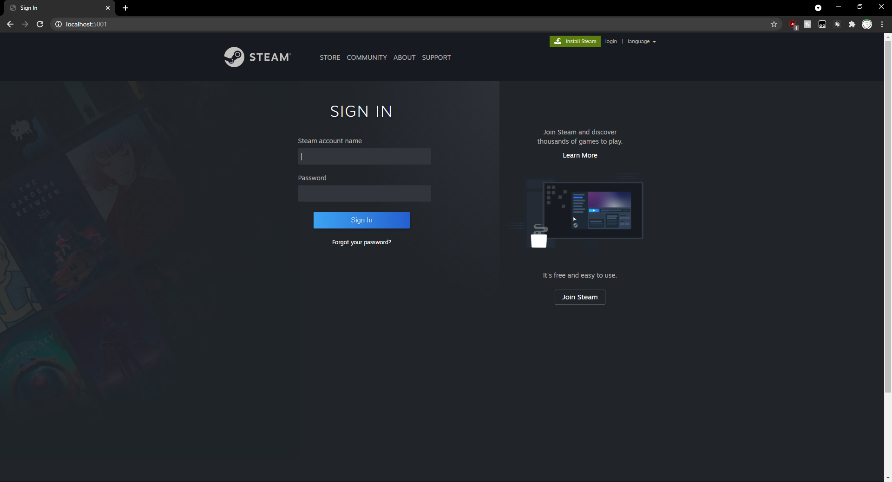

Assignment 7

YT Video: https://youtu.be/5tXgSPT3y7I

Files:

    index.js:
        js that i used to scrape the steamcommunity website.

    /node-homepage:
        all files generated by the scraping script
    
    node-homepage/ index.html:
        html page for the phishing site.
    
    log.txt:
        txt file that logs all phished info about the site.

    server.js:
        node server hosting the phishing site.
    
scraped website: 

