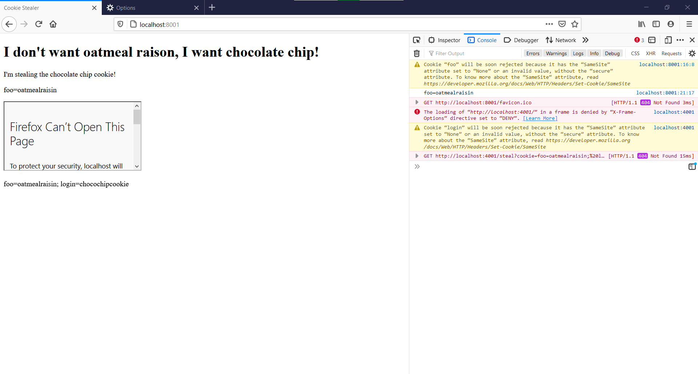

# Assignment 4: Frames

## Framable

### This section was completed using 2 files
* [writeHtmlFiles.sh](framable/writeHtmlfiles.sh):  Shell script that takes each line/top-level domain of the [LBART001@ODU.EDU](LBART001@ODU.EDU) file and outputs an iframe with the ```src``` attribute set to the format of ```http://top-level domain``` to a single html file for each line.
* [frame.js](framable/frame.js):  Node.js server that serves the entire [htmlPages](framable/htmlPages/) directory.

### Firefox version 87.0 for Windows 10 and its Console and Network developer tools were used to check if pages in the [framable/htmlPages](framable/htmlPages) directory are framable.

## Which public sites are frameable?
Site|Framable?|Method of defeating frame attempt|
----|---------|---------------------------------|
4shared.com|Yes||
abc.net.au|No|X-Frame-Options set to SAMEORIGIN|
about.com|No|X-Frame-Options set to SAMEORIGIN|
aboutads.info|No|X-Frame-Options set to SAMEORIGIN|
abril.com.br|Yes||
afternic.com|No|X-Frame-Options set to SAMEORIGIN|
aliexpress.com|No|X-Frame-Options set to DENY|
amazon.co.jp|No|X-Frame-Options set to SAMEORIGIN|
apache.org|Yes||
billboard.com|Yes||
bitly.com|No|X-Frame-Options set to DENY|
blog.fc2.com|Yes||
books.google.com|No|X-Frame-Options set to SAMEORIGIN|
bp0.blogger.com|N/A|HTTP 400|
change.org|No|X-Frame-Options set to sameorigin|
cisco.com|No| Content-Security-Policy set frame ancestors to list of sites; X-Frame-Options set to SAMEORIGIN|
cointernet.com.co|No|X-Frame-Options set to SAMEORIGIN|
coursera.org|No|X-Frame-Options set to SAMEORIGIN|
de.wikipedia.org|Yes||
detik.com|No|X-Frame-Options set to SAMEORIGIN|
disney.com|Yes||
doubleclick.net|Yes||
ebay.co.uk|No|X-Frame-Options set to SAMEORIGIN|
economist.com|Yes||
evernote.com|No|X-Frame-Options set to SAMEORIGIN|
fandom.com|No|X-Frame-Options set to SAMEORIGIN|
feedburner.google.com|No|X-Frame-Options set to DENY|
finance.yahoo.com|No|X-Frame-Options set to SAMEORIGIN|
foursquare.com|No|X-Frame-Options set to SAMEORIGIN|
ft.com|Yes||
gmail.com|Yes||
godaddy.com|No|X-Frame-Options set to DENY|
google.co.uk|No|X-Frame-Options set to SAMEORIGIN|
google.com.br|No|X-Frame-Options set to SAMEORIGIN|
google.it|No|X-Frame-Options set to SAMEORIGIN|
gooyaabitemplates.com|Yes||
home.pl|No|X-Frame-Options set to SAMEORIGIN|
huffpost.com|No|Content-security-policy set frame ancestors to self|
ibm.com|Yes||
icann.org|No|X-Frame-Options set to SAMEORIGIN|
ikea.com|No|X-Frame-Options set to SAMEORIGIN|
imdb.com|No|X-Frame-Options set to SAMEORIGIN|
istockphoto.com|No|X-Frame-Options set to SAMEORIGIN|
it.wikipedia.org|Yes||
ja.wikipedia.org|Yes||
lefigaro.fr|Yes||
lemonde.fr|No|X-Frame-Options set to SAMEORIGIN|
line.me|Yes||
live.com|Yes||
livescience.com|Yes||
lycos.com|No|Content-security-policy set frame ancestors to self|
marriott.com|Yes||
medium.com|Yes||
megaupload.com|N/A|Site did not resolve|
my.yahoo.com|No|Content-security-policy set frame ancestors to self; X-Frame-Options set to SAMEORIGIN|
myaccount.google.com|Yes||
namecheap.com|No|X-Frame-Options set to SAMEORIGIN|
namesilo.com|No|Content-Security-Policy set frame ancestors to list of sites; X-Frame-Options set to SAMEORIGIN|
netvibes.com|No|X-Frame-Options set to SAMEORIGIN|
news.google.com|No|X-Frame-Options set to SAMEORIGIN|
newscientist.com|No|X-Frame-Options set to DENY|
nokia.com|No|Content-security-policy set frame ancestors to self; X-Frame-Options set to SAMEORIGIN|
nps.gov|Yes||
opera.com|No|Content-security-policy set frame ancestors to self; X-Frame-Options set to SAMEORIGIN|
ovh.co.uk|No|X-Frame-Options set to SAMEORIGIN|
ox.ac.uk|No|Content-security-policy set frame ancestors to self|
pbs.org|No|X-Frame-Options set to DENY|
photobucket.com|Yes||
photos1.blogger.com|N/A|HTTP 404|
pixabay.com|No|Content-security-policy set frame ancestors to none; X-Frame-Options set to DENY|
plesk.com|No|X-Frame-Options set to SAMEORIGIN|
princeton.edu|No|X-Frame-Options set to SAMEORIGIN|
pt.wikipedia.org|Yes||
quora.com|No|X-Frame-Options set to SAMEORIGIN|
rakuten.co.jp|No|X-Frame-Options set to DENY|
rambler.ru|No|X-Frame-Options set to SAMEORIGIN|
ria.ru|Yes||
sapo.pt|No|X-Frame-Options set to SAMEORIGIN|
sedo.com|Yes||
slideshasre.net|No|X-Frame-Options set to SAMEORIGIN|
smh.com.au|No|Content-security-policy set frame ancestors to self; X-Frame-Options set to sameorigin|
spiegel.de|Yes||
spotify.com|No|Content-security-policy set frame ancestors to self; X-Frame-Options set to deny|
stanford.edu|No|X-Frame-Options set to SAMEORIGIN|
storage.canalblog.com|Yes||
support.google.com|No|X-Frame-Options set to SAMEORIGIN|
telegraph.co.uk|No|Content-security-policy set frame ancestors to self; X-Frame-Options set to SAMEORIGIN|
thedailybeast.com|No|X-Frame-Options set to SAMEORIGIN|
thenextweb.com|No|X-Frame-Options set to SAMEORIGIN|
transandfiestas.ga|N/A|Connection timeout|
twitch.tv|No|X-Frame-Options set to SAMEORIGIN|
vimeo.com|No|X-Frame-Options set to sameorigin|
w3.org|Yes||
washingtonpost.com|Yes||
wired.com|Yes||
www.blogger.com|Yes||
www.over-blog.com|No|X-Frame-Options set to DENY|
yale.edu|No|X-Frame-Options set to SAMEORIGIN|
ytimg.com|N/A|Site did not resolve|

## Table Summary
* Number of sites that are framable:
  * 33
* Number of sites that are not framable:
  * 61
* Number of exceptional cases or N/A:
  * 5
  * Exceptions and circumstances:
    * bp0.blogger.com: HTTP 400
    * megaupload.com: Site did not resolve
    * photos1.blogger.com: HTTP 404
    * transandfiestas.ga: Connection timeout
    * ytimg.com: Site did not resolve
### Methods of defeating frame attempts
* Sites that had X-Frame-Options set to SAMEORIGIN/sameorigin:
  * 41
* Sites that had X-Frame-Options set to DENY/deny:
  * 8
* Sites that had Content-security-policy set frame ancestors to self:
  * 3
* Sites that had Content-security-policy set frame ancestors to self and/or list of sites, and X-Frame-Options to SAMEORIGIN/sameorigin:
  * 7
* Sites that had Content-security-policy set frame ancestors to self or none, and X-Frame-Options set to DENY/deny:
  * 2

## Frame-attack

### There are two sets of files used in [frame-attack](frame-attack/)
* Insecure framable page:  These four files demonstrate "stealing" a cookie from an iframed page.
  * [victimServer.js](frame-attack/victimServer.js):  Node.js server that serves [iframedPage.html](frame-attack/iframedPage.html), which is stored in an iframe and has its cookie stolen.  The cookie is declared in the server using ```res.append```.
  * [iframedPage.html](frame-attack/iframedPage.html):  The html file that is embedded in an iframe and has its cookie, ```login=chocochipcookie```, stolen.
  * [attackerServer.js](frame-attack/attackerServer.js):  Node.js server that serves [cookieStealer.html](frame-attack/cookieStealer.html).
  * [cookieStealer.html](frame-attack/cookieStealer.html):  The html file that embeds [iframedPage.html](frame-attack/iframedPage.html) in an iframe and "steals" its cookie.

* Secure framable page:  These four files demonstrate a page that refuses to let itself be embedded in an iframe, and keep its cookie secure.
  * [secureVictimServer.js](frame-attack/secureVictimServer.js):  Node.js server that serves [securePage.html](frame-attack/securePage.html).  In order to protect the cookie from being stolen, the cookie is no longer declared in the server, it is declared in [securePage.html](frame-attack/securePage.html).  If the cookie is declared in the server like in [victimServer.js](frame-attack/victimServer.js), it does not matter if ```X-Frame-Options``` are set to ```SAMEORIGIN``` or ```DENY```, the iframed page's cookie will be displayed.  This can be seen in the two screenshots below.

  
  

  * [failedAttackerServer.js](frame-attack/failedAttackerServer.js):  Node.js server that serves [failedCookieSteal.html](frame-attack/failedCookieSteal.html).
  * [failedCookieSteal.html](frame-attack/failedCookieSteal.html):  The html file that attempts to steal the cookie of [securePage.html](frame-attack/securePage.html).  It fails because the cookie is declared inside the document instead of the server, and the ```X-Frame-Options``` for [securePage.html](frame-attack/securePage.html) are set to ```SAMEORIGIN```.

  ## YouTube videos:
  * framable:  https://youtu.be/i4s8NqvW1U4
  * frame-attack:  https://youtu.be/EQ4UElgxgEk