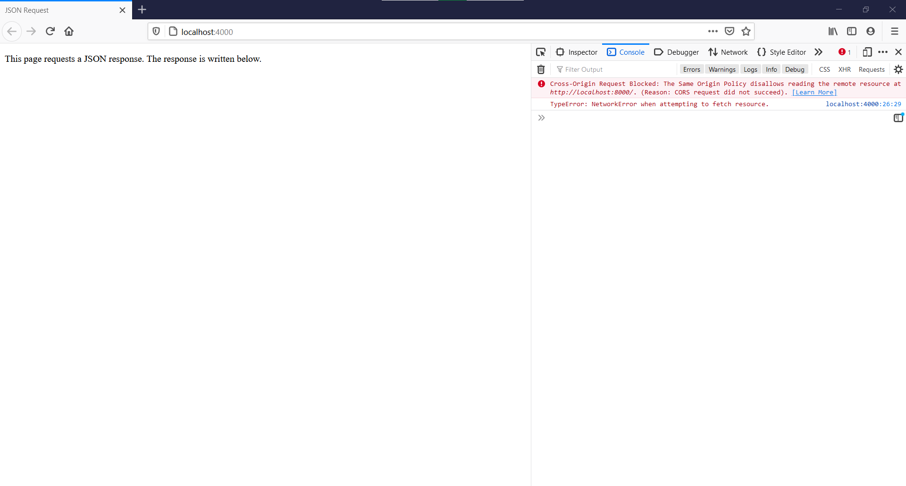
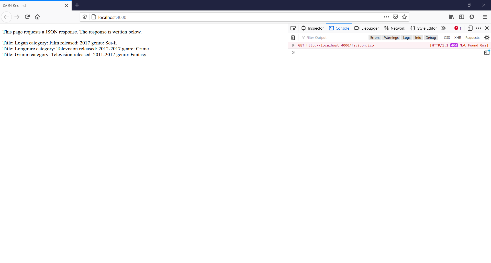
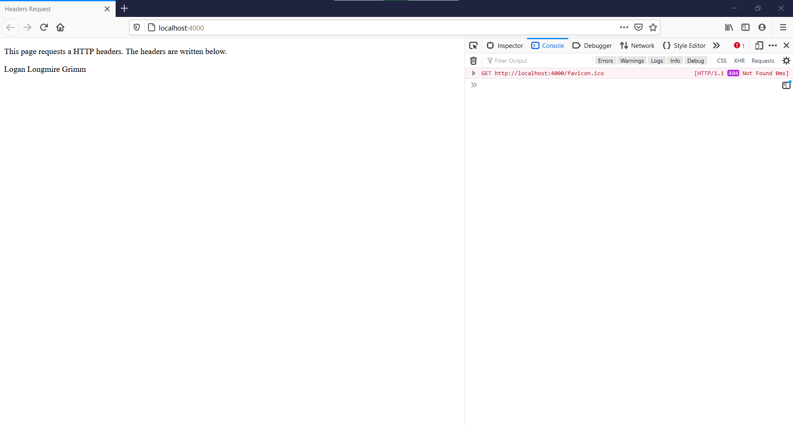
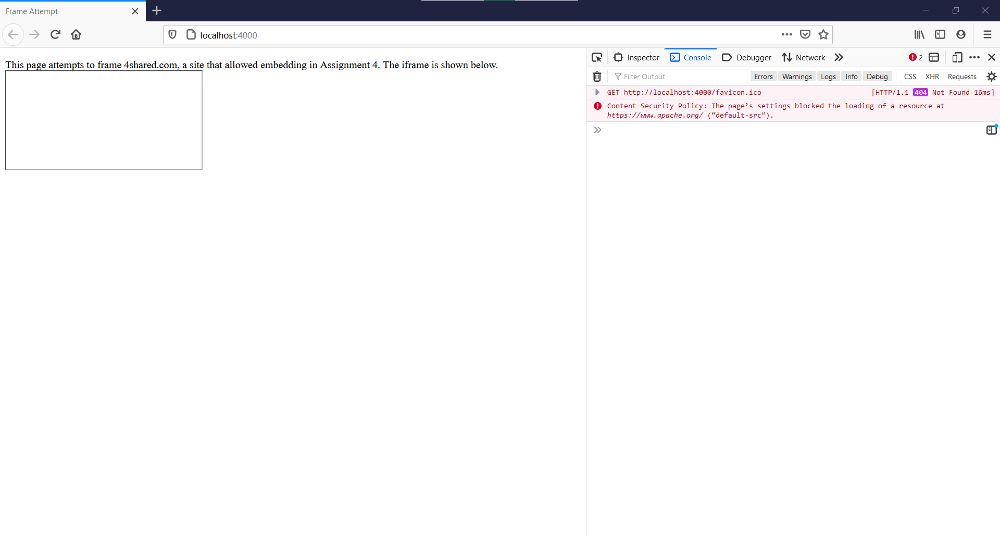

# Assignment 5: Same-origin Policy, CORS, CSP

## 5.1: Blocking and reading responses from another origin using CORS

### This section was completed using 2 directories: request and response.  They are broken down below.
* [request](5.1/request/)
  * [request.html](5.1/request/request.html):  HTML page that performs a fetch to port 8000 on localhost and attempts to write the JSON response in the HTML body.
  * [request.js](5.1/request/request.js): Node.js server that serves request.html.
* [response](5.1/response)
  * [favoriteThings.json](5.1/response/favoriteThings.json):  JSON file that contains the JSON response about my 3 favorite things from Assignment 1.
  * [deny-response.js](5.1/response/deny-response.js):  Node.js server that serves favoriteThings.json on localhost port 8000.  Denies cross origin request from request.html.  This is shown below.
  
  
  * [allow-response.js](5.1/response/allow-response.js)  Node.js server that serves favoriteThings.json on localhost port 8000.  Allows cross origin request from request.html using the cors npm package.  The line ```app.use(cors())``` sets the ```Access-Control-Allow-Origin``` header to ```*```.  This means that the server's resources can be accessed by any origin.  The successful request is shown below.
  

### YouTube video:  https://youtu.be/X1joWbtdvXE

## 5.2: Blocking and reading HTTP response headers from another origin using CORS

### This section was completed using 5 files:
* [headers.html](5.2/headers.html):  HTML file that performs a fetch to port 8000 on localhost and attempts to write the response headers in the HTML body.
* [request.js](5.2/request.js):  Node.js server that serves headers.html.
* [favoriteThings.json](5.2/favoriteThings.json):  JSON file that contains the JSON response about my 3 favorite things from Assignment 1.
* [block-headers.js](5.2/block-headers.js):  Node.js server that serves favoriteThings.json on localhost port 8000.  Blocks cross-origin request from headers.html because the ```Access-Control-Allow-Origin``` header is not set.  Also serves 3 custom HTTP response headers shown below.
  * ```X-CS595s21-amazonshow: Grimm```
  * ```X-CS595s21-marvelmovie: Logan```
  * ```X-CS595s21-netflixshow: Longmire```
  * The blocked cross-origin request from headers.html is shown below


* [allow-headers.js](5.2/allow-headers.js):  Node.js server that serves favoriteThings.json on localhost port 8000.  Also serves the same 3 custom HTTP response headers as block-headers.js.  Allows the cross-origin request from headers.html because the line ```app.use(cors())``` sets the ```Access-Control-Allow-Origin``` header to ```*```.  This means that the server's resources can be accessed by any origin.  The successful request is shown below.


### YouTube video:  https://youtu.be/AH3hwWWcD3g

## 5.3: Content-Security-Policy: embedding from another site

### This section was completed using 3 files:
* [frame.html](5.3/frame.html):  HTML file that attempts to embed apache.org in an iframe.
* [block-framing.js](5.3/block-framing.js):  Node.js server that serves frame.html uses Content-Security-Policy to prevent embedding of apache.org by setting ```default-src``` to ```self```.  The blocked frame attempt is shown below.


* [allow-framing.js](5.3/allow-framing.js):  Node.js server that serves frame.html uses Content-Security-Policy to allow embedding of apache.org by setting ```default-src``` to ```self``` and ```https://www.apache.org```.  The successful frame attempt is shown below.


### YouTube video:  https://youtu.be/QaNwiyWptZY
