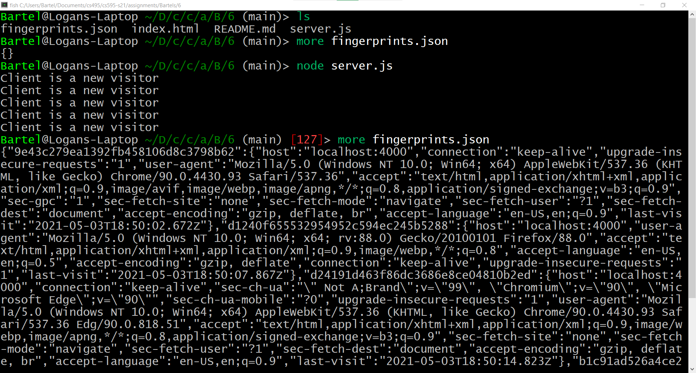
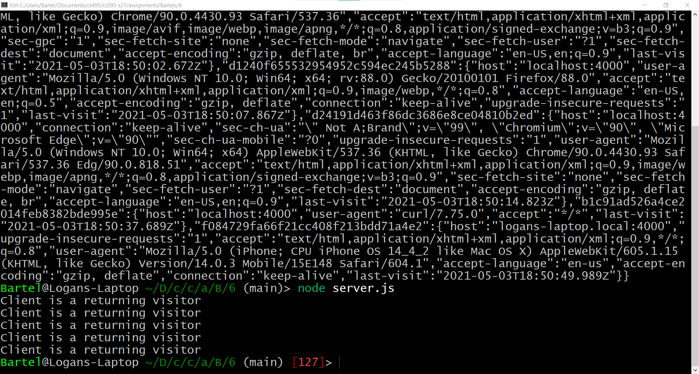

# Assignment 6: Fingerprinting

## File Summary

### This assignment was completed using 3 files:

* [server.js](server.js): Node.js server that serves [index.html](index.html) and fingerprints visiting clients.
* [index.html](index.html): html page that is served to all clients.
* [fingerprints.json](fingerprints.json): JSON file to store client fingerprints for comparison to future visitors.

### Fingerprinting Algorithm

The algorithm begins by loading in ```fingerprints.json``` and assigning it to the ```visitorLog```.
An empty list is created to store the headers used to fingerprint the visiting client.
The following headers are appended to the list:

* ```Accept-Language```
* ```Accept-Encoding```
* ```Accept```
* ```User-Agent```

The list is converted to a string, and then hashed using ```md5```.  The hash is then stored in the ```id``` variable.
If the hashed id is already present in the ```visitorLog``` (i.e. ```fingerprints.json```), update the ```last-visit``` attribute to the current date and write out the updated visitor log to ```fingerprints.json```.
Then write out ```Client is a returning visitor``` to the console.

If the id is not present in the ```visitorLog```, append all headers and the current date to the id in the ```visitorLog```.
Then write out the updated ```visitorLog``` to ```fingerprints.json```.

### Screenshots

Below are 2 screenshots showing the fingerprinting of 5 clients.  The order they are listed is the order they were fingreprinted from first to last.

The 5 clients are the following:
* Brave
* Firefox
* Edge
* curl
* iPhone Safari



The top of the above screenshot shows an empty ```fingerprints.json```; the file only contains ```{}```.
Then each client is fingerprinted as a new client.  Next, the updated contents of ```fingerprints.json``` are shown.



In the above screenshot, each client's page is refreshed.  Because they have already been fingreprinted, the ```Client is a returning visitor``` message is displayed.

### YouTube Video

https://youtu.be/k5amSA2oSTg