# Assignment 5, CS 495/595 Web Security, Spring 2021


## CORS: Blocking and reading responses from another origin

### List of files in 5.1
* [Fave.html](5.1/Fave.html): Html file requesting JSON
* [special.json](5.1/special.json): JSON response
* [server_1.js](5.1/server_1.js): Host Fave.html
* [server_2_cors.js](5.1/server_2_cors.js): Host special.json and allow cross-origin
* [server_2.js](5.1/server_2.js): Host special.json 

### Youtube Video: https://youtu.be/UMlJcHdEfdE

### Summary
1. Demonstrating the request for the special.json response from another origin is denied by CORS policy.
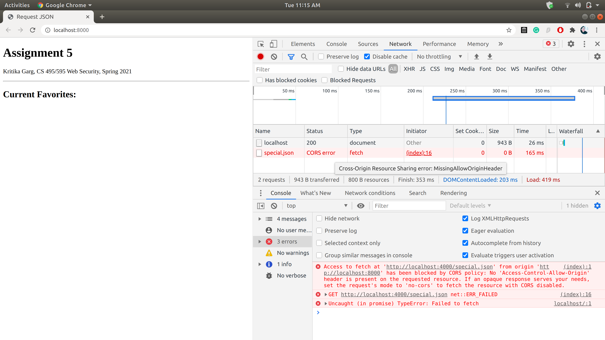

2. Demonstrating the request for the special.json response from another origin is allowed when the 'Access-Control-Allow-Origin' header is set for the JSON response. The code block below shows how the header is set, "*" denotes that all origins can access the special.json file.
```
app.use(function(req, res, next) {
	// Allow all origins
	res.header("Access-Control-Allow-Origin", "*");
	next();
  });
```
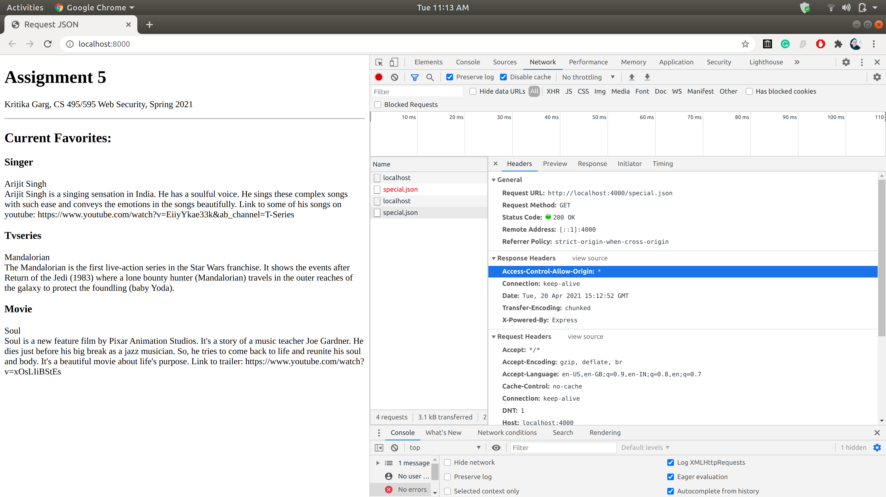


## CORS: Blocking and reading HTTP response headers from another origin

### List of files in 5.2
* [show_header_value.html](5.2/show_header_value.html): HTML file displaying custom headers values
* [server_1.js](5.2/server_1.js): Host the HTML file
* [server_2.js](5.2/server_2.js): Setting custom headers 
* [server_2_allowheader.js](5.2/server_2_allowheader.js): Allowing and exposing the custom headers values.

### Youtube Video: https://youtu.be/PwJMrIAEFT4

### Summary

1. The custom HTTP response headers in node.js are set as follows:
```
	res.header('X-CS595s21-movie', 'Soul')
    res.header('X-CS595s21-tvseries', 'Mandalorian')
    res.header('X-CS595s21-singer', 'Arijit Singh') 
```
2. The figure below demonstrates how the HTML file hosted on localhost:8000 is unable to fetch the header values for the custom response headers set for JSON response from another origin.
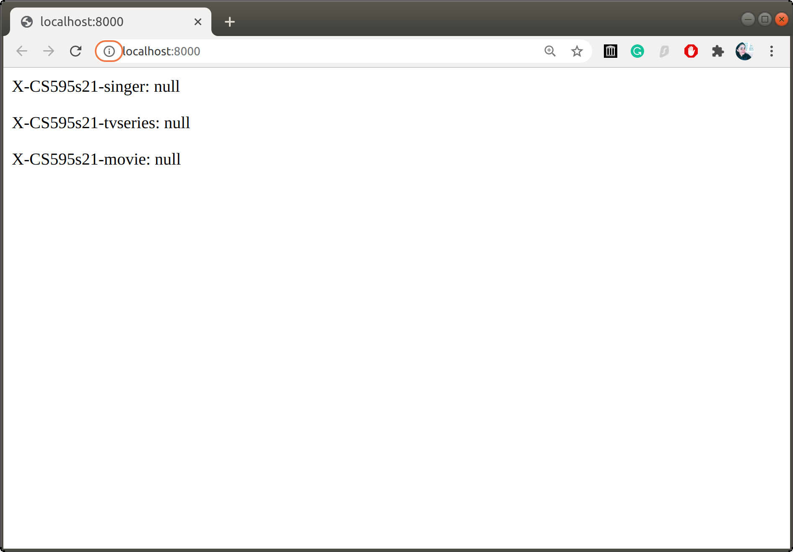

3. The figure below demonstrates how the HTML file hosted on localhost:8000 can fetch the header values for a response from another origin after the following headers are set.
```
    res.header('Access-Control-Allow-Headers', '*' );
    res.header('Access-Control-Expose-Headers', '*' );
```
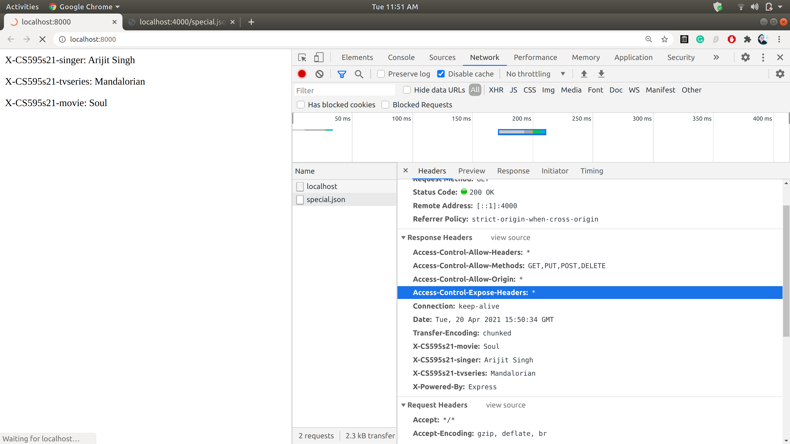


## Content-Security-Policy: embedding from another site

### List of files in 5.3
* [framesite.html](5.2/framesite.html): HTML with external iframe.
* [server_1.js](5.2/server_1.js): Host HTML with CSP header allowing cross-origin
* [server_2.js](5.2/server_2.js): Host HTML with CSP header disallowing cross-origin.

### Youtube Video: https://youtu.be/1IYY__iT-hw

### Summary
1. Demonstrating the use of 'Content-Security-Policy' to deny the embedding of a site from another origin.
```
res.header("Content-Security-Policy", "frame-src 'self'; script-src 'self' 'unsafe-inline'");
```
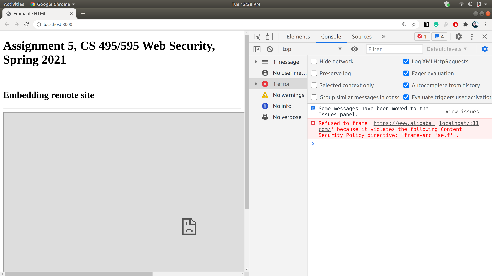


2. Demonstrating the use of 'Content-Security-Policy' to allow the embedding of a site from another origin. As shown in the code block below, we have added the 'https://www.alibaba.com/' to the list of domains allowed for framing.
```
res.header("Content-Security-Policy", "frame-src 'self' https://www.alibaba.com/; script-src 'self' 'unsafe-inline'");
```
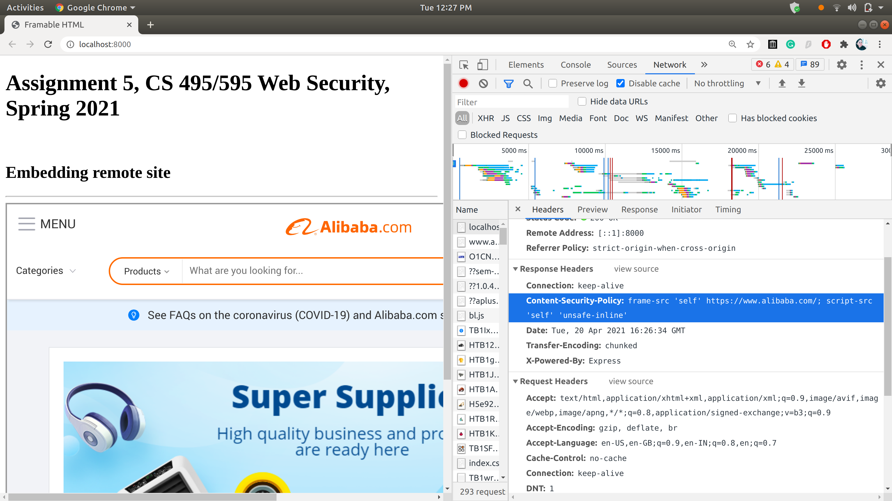

## GitHub Pages (Extra Credit)

* Repeated the excercises in ```5.1```, ```5.2```, ```5.3```  with one set of files served from [GitHub Pages](https://pages.github.com/).

* Link: https://kritikagarg.github.io/cs595s21A5/
* Github Repo: https://github.com/kritikagarg/cs595s21A5

### Youtube Video: https://youtu.be/EpphQ9lYi10

### Summary
Index.html shows the list of all the HTML files hosted on GitHub Pages for each exercise. 
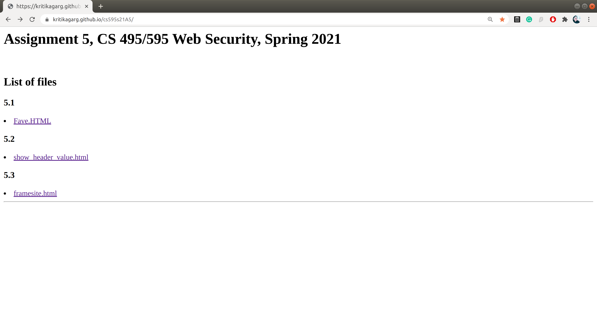

5.1. Demonstrating the use of CORS policy. Here the HTML page is hosted on GitHub while the requested JSON is served from the localhost. The below figures demonstrate how the request is blocked at first and then allowed after the 'Access-Control-Allow-Origin' header is set. 
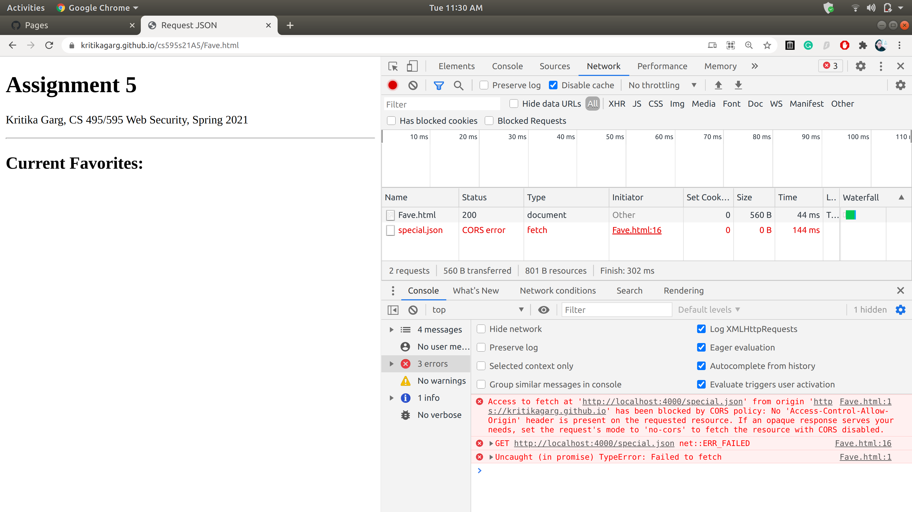


5.2. Same as above, the HTML page is hosted on GitHub while the requested JSON is served from the localhost. The below figures demonstrate how the access to custom HTTP headers is blocked at first and then allowed after the 'Access-Control-Allow-Headers' and 'Access-Control-Expose-Headers' headers are set.   
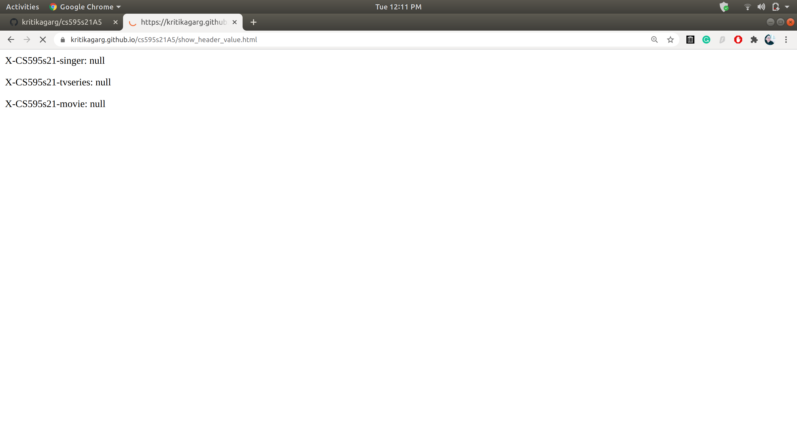
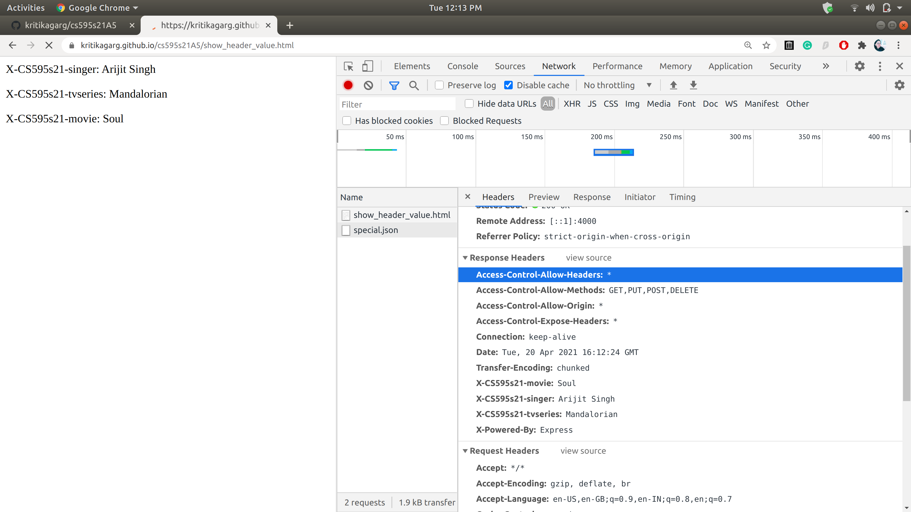

5.3. For this exercise, we hosted the framesite.html on GitHub. As shown in the figure, the GitHub server allowed the framing of the site from another origin (https://www.alibaba.com/).
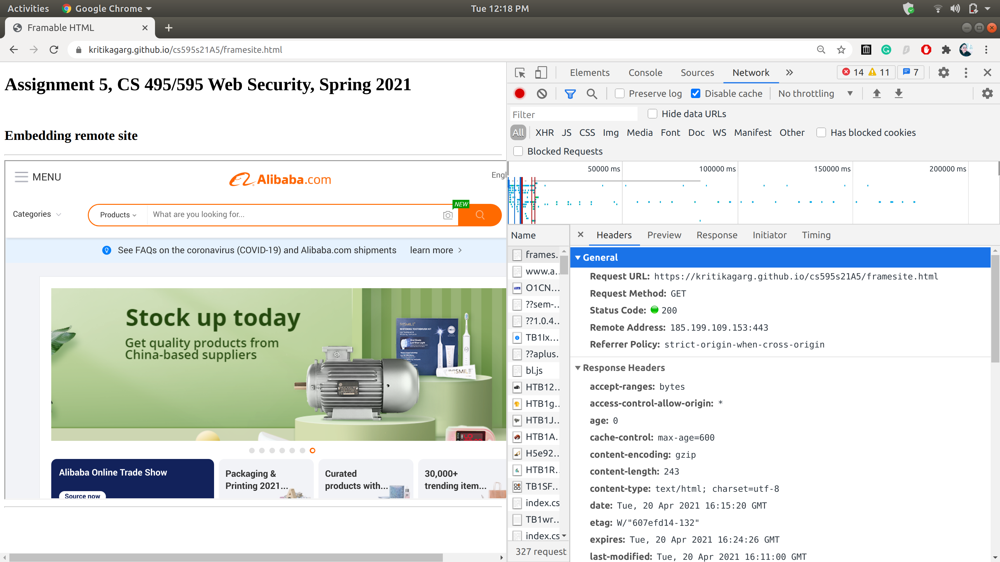
