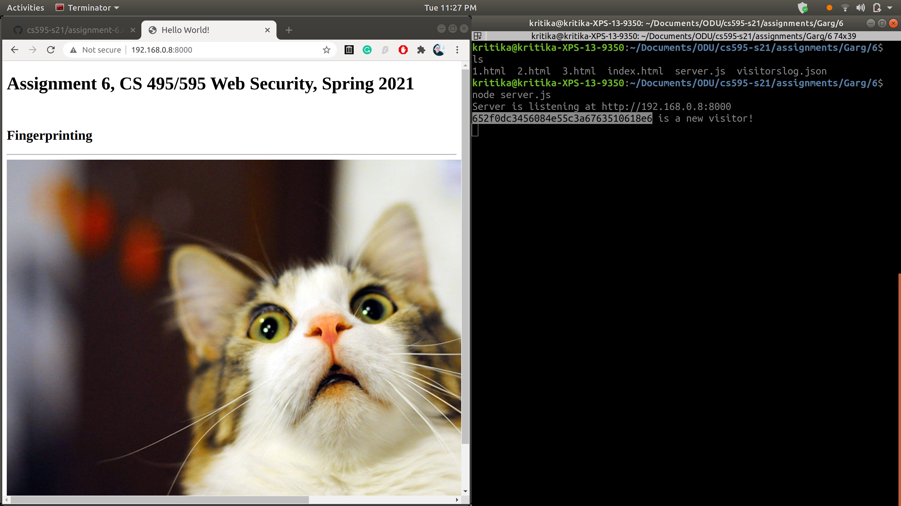
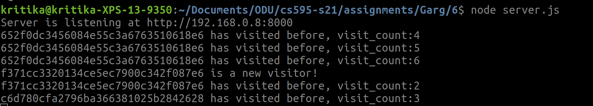
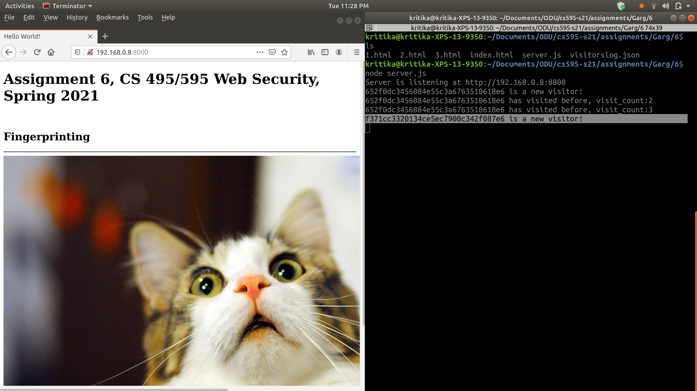
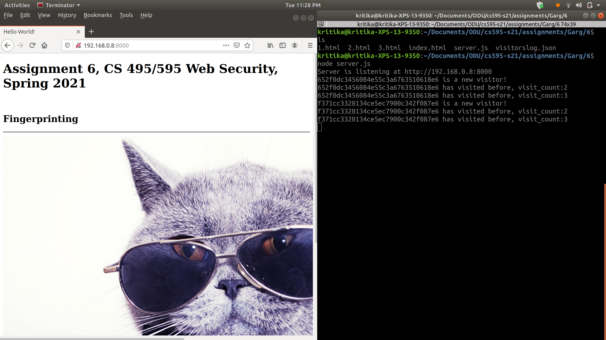
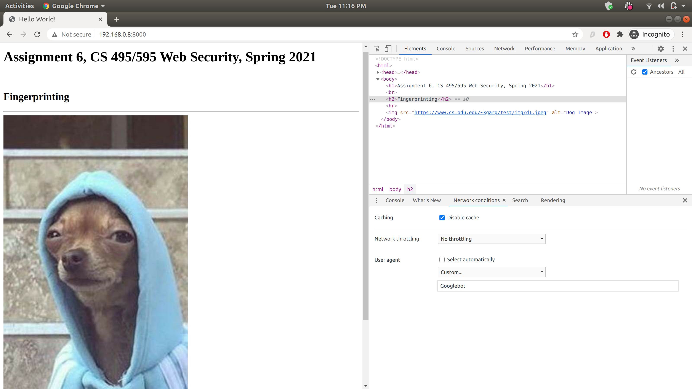
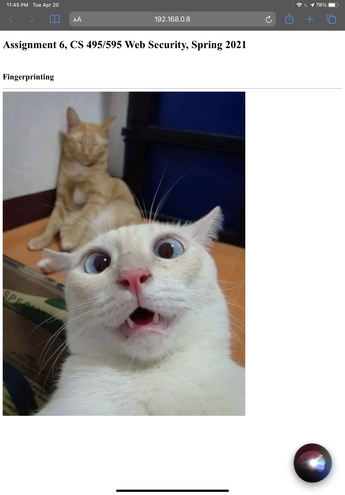
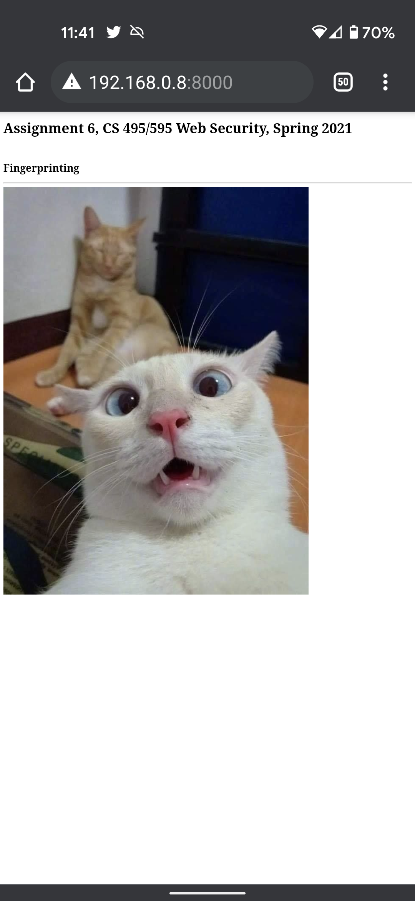
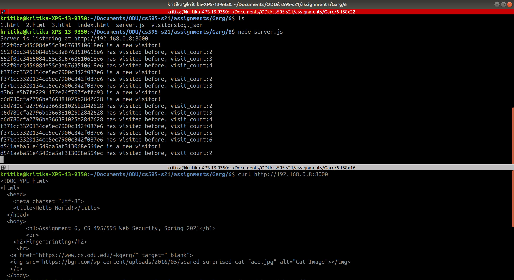

# Assignment 6, CS 495/595 Web Security, Spring 2021

### List of files
* [server.js](server.js): Serves HTML files and also does fingerprinting.
* [index.html](index.html): HTML file served to new clients.
* [visitorlog.json](visitorlog.json): JSON storing information of all the clients.
* [1.html](1.html): HTML file served to existing clients with UA other than 'Firefox' or 'Googlebot'. 
* [2.html](2.html): HTML file served to clients with Firefox user-agent.
* [3.html](3.html): HTML file served to Googlebot.

### Youtube Video: https://youtu.be/tezTvAS7aCY

## Fingerprinting Algorithm

1. For every client that visits our hosted server, a unique client id is created. To generate the unique client id, we hash the client's IP address along with the request headers such as Accept, Accept-Language, Accept-Encoding, and User-Agent. For this algorithm, the MD5 hash function is used. 
```		
        fingerprint.push(req.headers['x-forwarded-for'] || req.connection.remoteAddress);
	    fingerprint.push(req.get('Accept'));
	    fingerprint.push(req.get('Accept-Language'));
	    fingerprint.push(req.get('Accept-Encoding'));
	    fingerprint.push(req.get('User-Agent'));

	    var fingerprint = fingerprint.toString(); 
	    var client_id = md5(fingerprint);
```
2. This client id is used to identify the client and verify whether the client has visited us before or not. If a client is a new visitor, then the following steps are taken.
    1. The new client's id is displayed on the console.
    2. The new client is served index.html

    

    3. The client's id along with their request headers are stored in the visitorslog.json
    4. The datetime of the client's visit is also stored in the JSON.


```
 		    	console.log(`${client_id} is a new visitor!`);

		    	stream = createReadStream('index.html');
	    		stream.pipe(res);

		    	visitorslog[client_id] = req.headers;
		    	visitorslog[client_id]['last-visit'] = [new Date()];
```

3. If the client id exists in the visitorslog.json that means that client has visited us before. In this case, the following steps are taken.
    1. The datetime of the visit is added to the visiterslog.json
    2. The client's id is displayed on the console along with the number of times the client has visited our page.
    3.  We identify the user-agent of the client and serve them accordingly (cloaking).

    

```
		    	//oldclient
		    	visitorslog[client_id]['last-visit'].push(new Date());
		    	var visit_count = visitorslog[client_id]['last-visit'].length;
		    	console.log(`${client_id} has visited before, visit_count:${visit_count}`);

```
## Cloaking (Extra credit)

1. For an existing client, we identify their user-agent and serve them the HTML other than index.html. 
```
		    	//Cloaking
		    	var ua = visitorslog[client_id]['user-agent']

		    	if (ua.includes('Googlebot'))
		    	{
					stream = createReadStream('3.html');
		    		stream.pipe(res);

		    	} else if (ua.includes('Firefox')){
                    				
					stream = createReadStream('2.html');
		    		stream.pipe(res);
		    		
		    	} else {
			    	stream = createReadStream('1.html');
		    		stream.pipe(res);
		    	}
```
## Fingerprint at least 5 different clients

### Firefox
- All first-time clients are served index.html. On the next visit, if the user-agent is 'Firefox', the client is served 2.html.






### Googlebot
- If the client's user-agent is 'Googlebot', the client is served the HTML file with a dog image instead of a cat image. This is to replicate SEO cloaking, where the content presented to the search engine bots such as 'Googlebot' is different from that presented to the user's browser.




### Ipad (Safari) 
- HTML file '1.html' is served to the existing clients with user-agent other than 'Firefox' or 'Googlebot'. The below figure, shows the HTML being accessed on an Ipad device. The client's fingerprint details are stored in visitorslog.json.  




### Mobile (chrome)
- HTML file '1.html' is served to the existing clients on the mobile device. 




### Curl
- HTML file '1.html' is served to the existing clients using curl request. 




