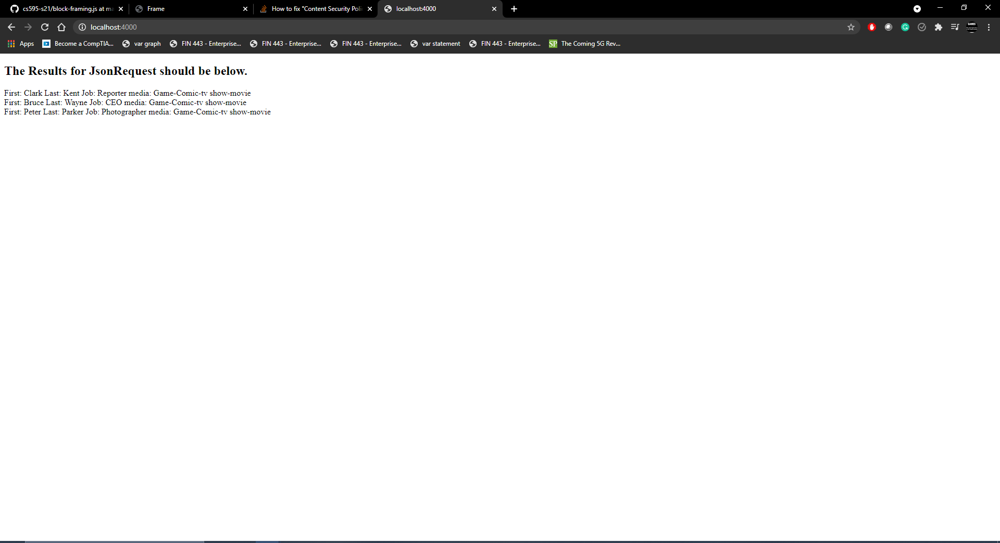
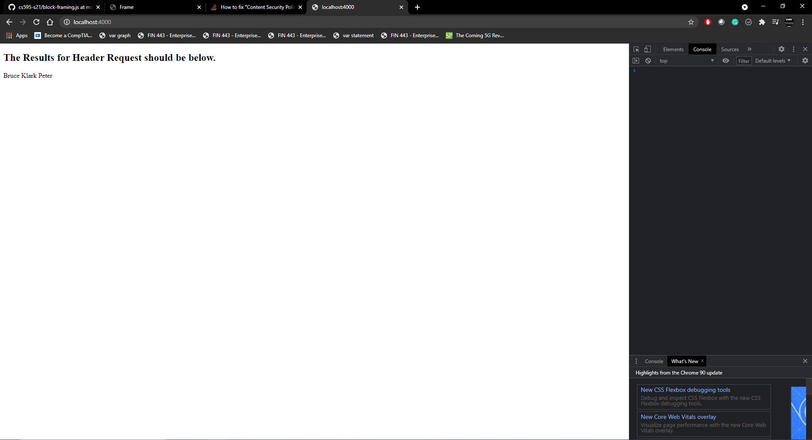
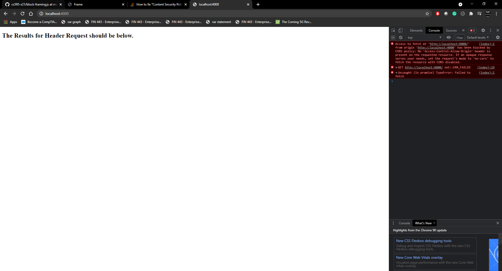
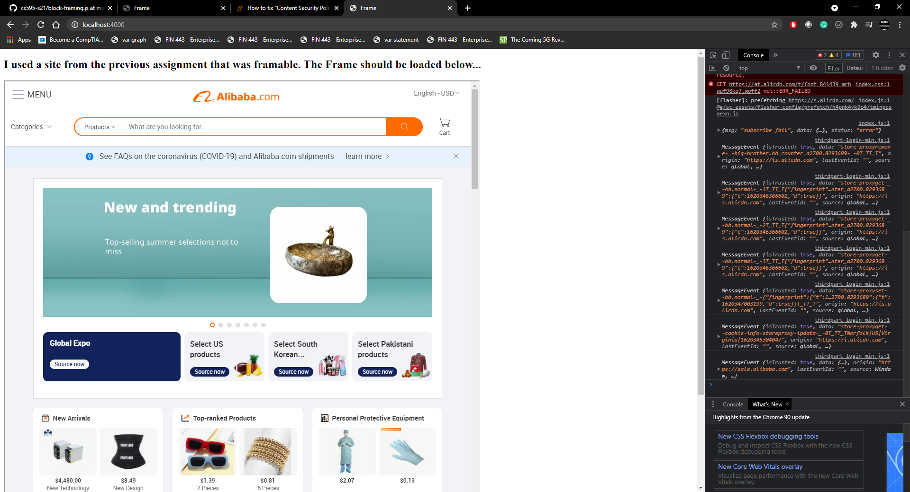
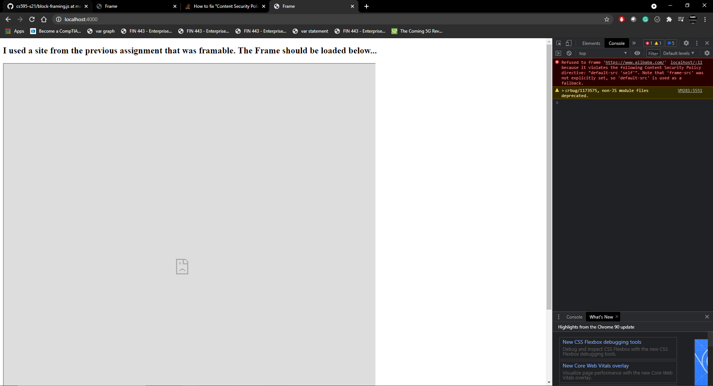

This file is my summary of assignment 5

Here we start with the 5.1 results. 
-------------------------------------
* [Results.json](5.1/Results.json/) The file with the infromation the request is attempting to read
* [J-Request.js](5.1/J-Request.js/) Node server for Javascript that host the html. 
* [J-Request.html](5.1/J-Request.html/) Html for the Node server. It executes a fetch at the designated port and tries to get a Response from JSON .

* [Allow.js](5.1/Allow.js/) This server is used as an example of when the response from the JSON file is allowed. The picture example is below. 

* [Block.js](5.1/Block.js/) This server is used as an example of when the response to JSON file is blocked. The picture example is below

5.2 Results 
-----------------------------------------------
* [Results.json](5.2/Results.json/) The file with the infromation the request is attempting to read
* [H-Request.js](5.2/H-Request.js/) Node server for Javascript that host the html. 
* [H-Request.html](5.2/H-Request.html/) Html that will be displayed in the Node server. It executes a fetch at the designated port and tries to write information form the JSON

* [Allow.js](5.2/Allow.js/) This server is set up to allow the response from the server and get the information. The picture example is below.

* [Block.js](5.2/Block.js/) This server is set up to block the attempt to get a response. the picture example is below. 

5.3 Results
------------------------------------------------
This section is about trying to get a frame on a server. I will also attempt to block and allow access to the file. 

* [Frame.html](5.3/Frame.html/) Html file that tries to embed Alibaba.com. 
* [Allow.js](5.3/Allow.js/) Node server set up to allow the page to be embeded. The picture example should be below. 

* [Block.js](5.3/Block.js/) This server is set up to block the embed in the Iframe to Alibaba.com. The picture example should be below. 

Youtube link: https://youtu.be/LdAQrGVxqQc
