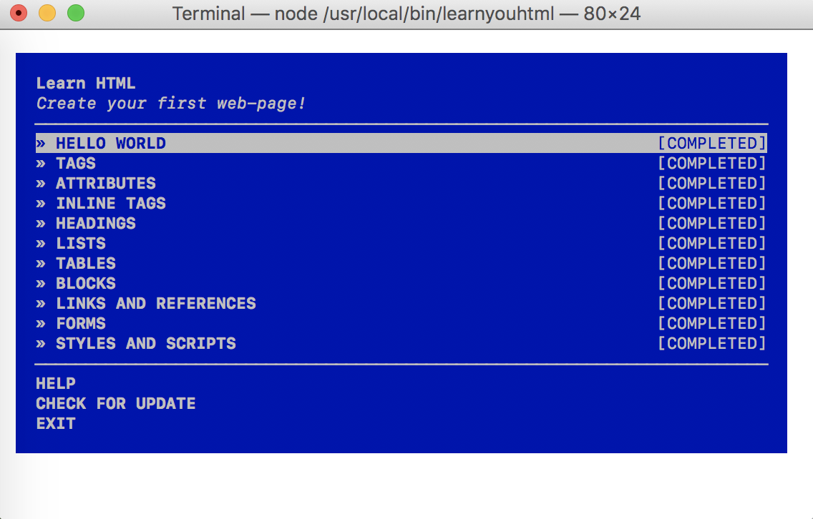
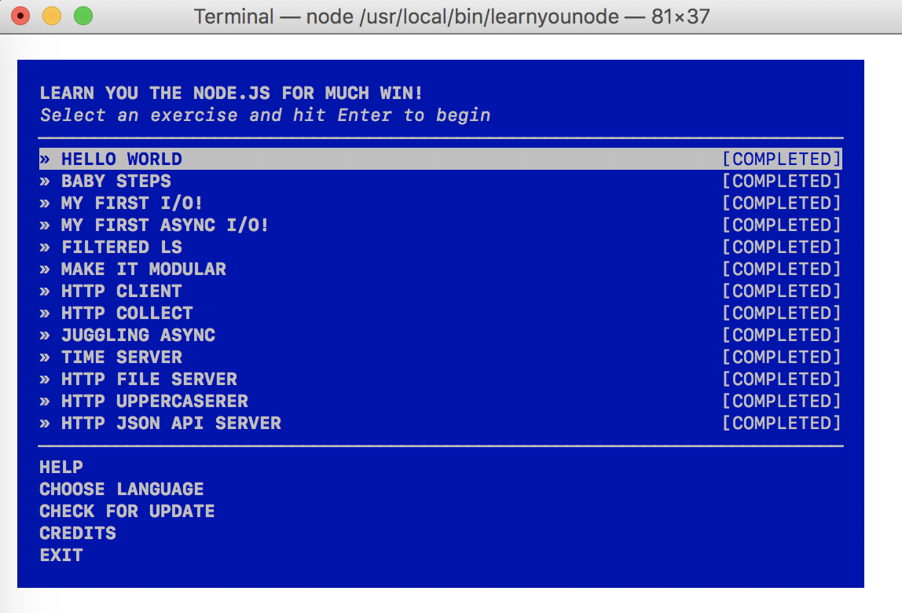

In this assignment, I used learnyouhtml, javascripting, and learnyounode
commands to complete a series of exercises in each one. I created files for
each task, followed the directions, edited each file, and finally, verified
the files to ensure they were correct and allow me to move forward to the next
exercise.After completing all the files and exercises in those commands, I 
screen-recorded myself going though the commands and showing the completion
of each exercise. 

Youtube link:https://youtu.be/h18XvYiOBnw 

Screenshots:

