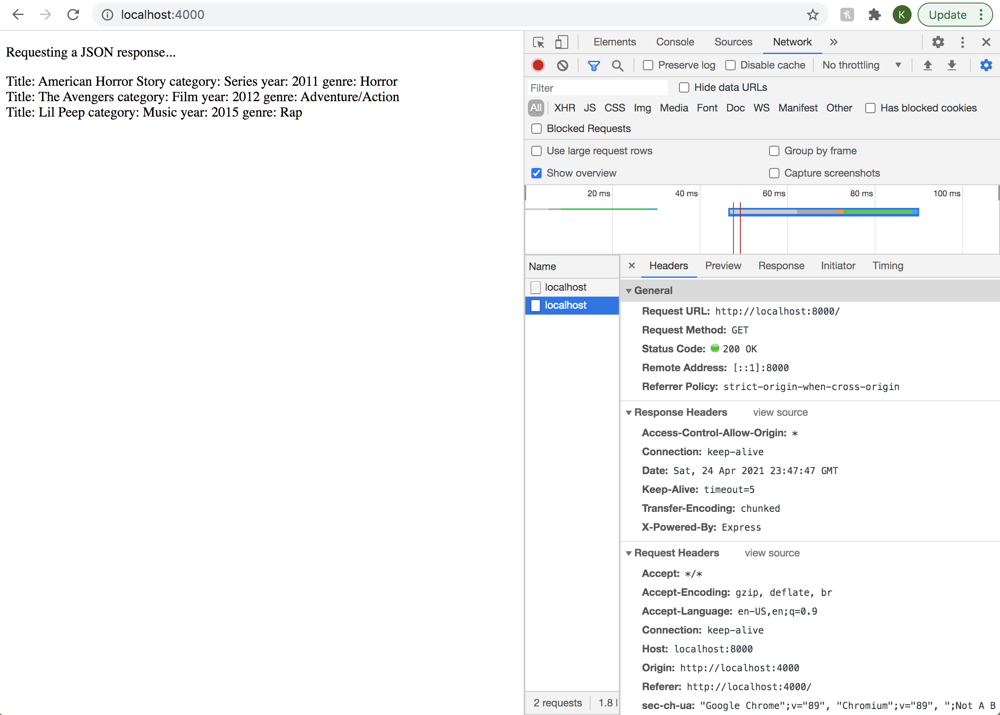
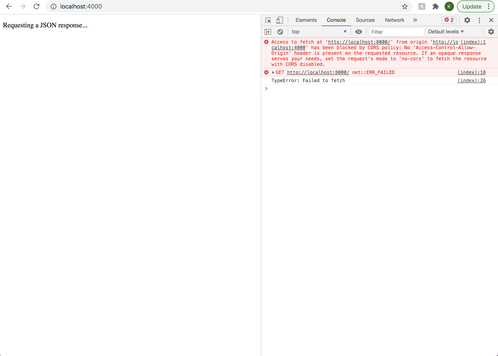
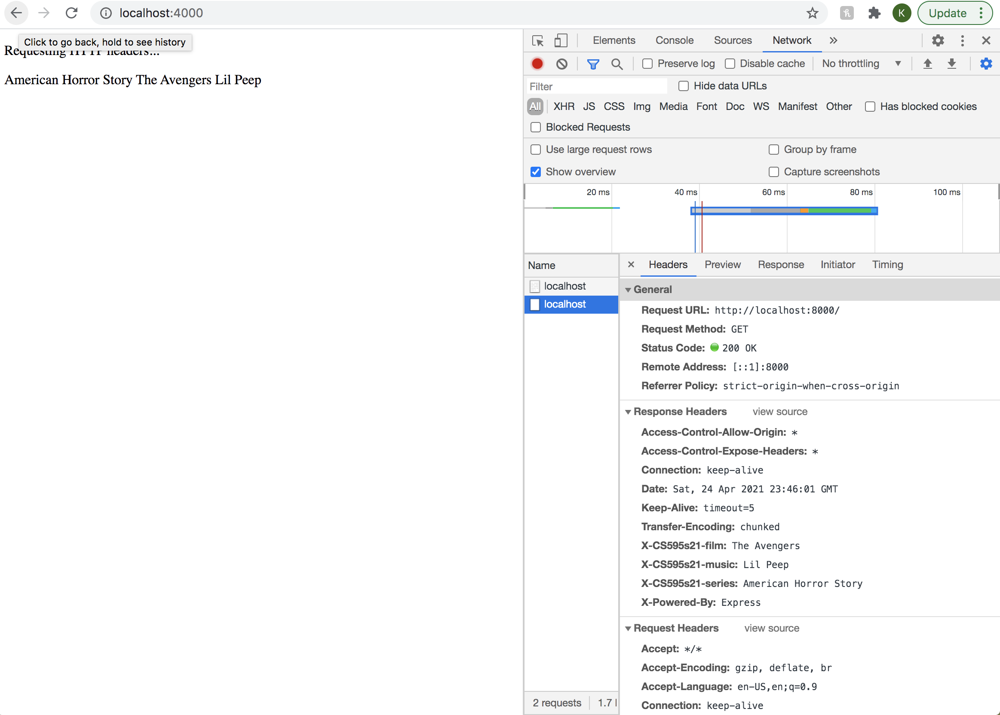
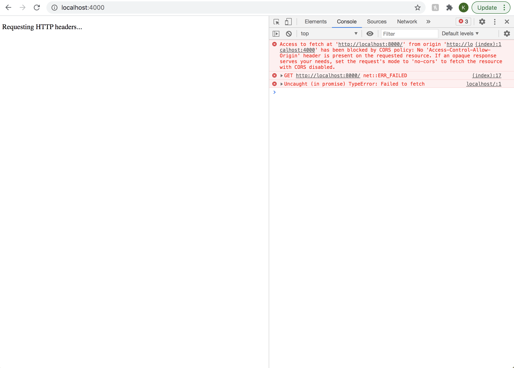
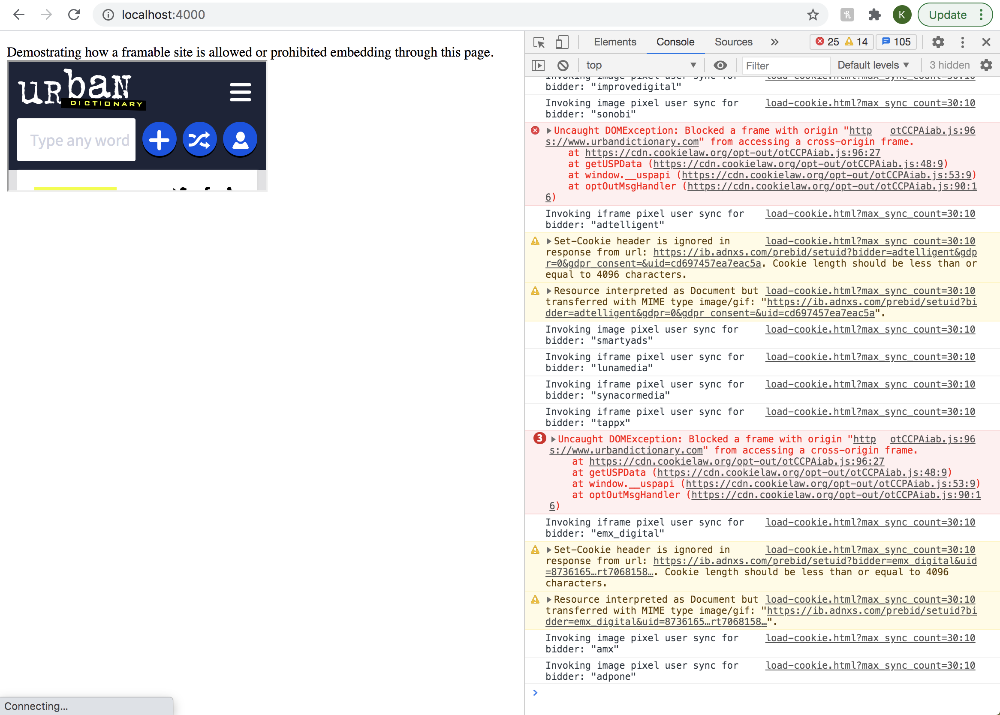
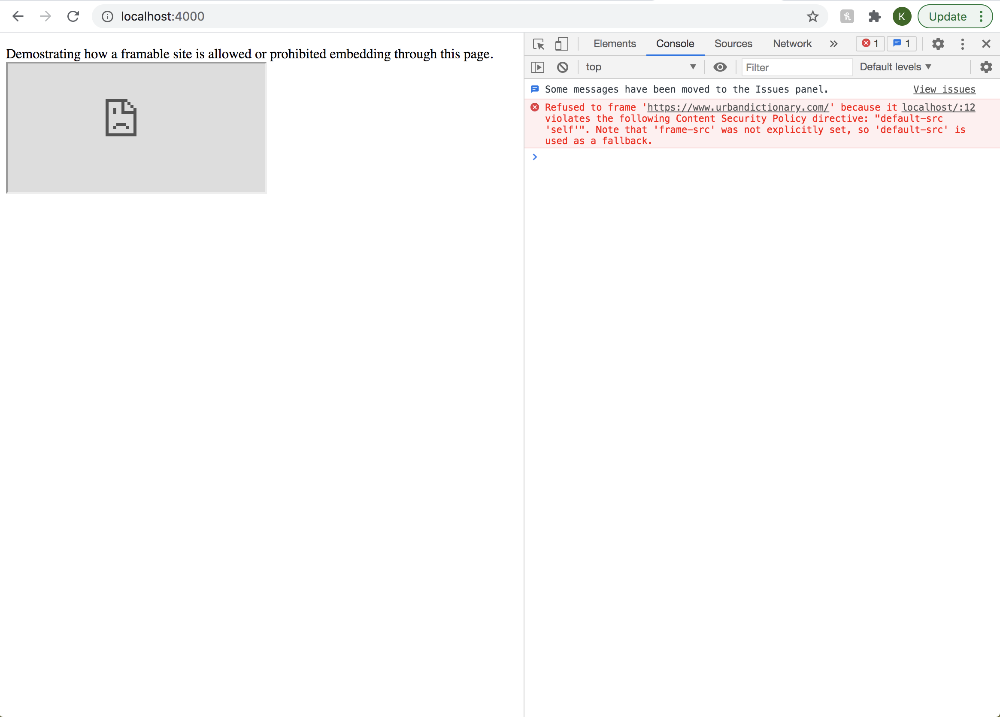

## 5.1

I used node.js, HTML, and json files to demonstrate Javascript running in one HTML file requesting a .json response from another origin. 

[JSONrequest.js](JSONrequest.js): The node server that displays the HTML page.
[JSONrequest.html](JSONrequest.html): The HTML page that will display the .json response depending on whether it is blocked or not. 
[Favorites.json](Favorites.json):The JSON file containing my three favorite things from assignment 1.
[allowresponse.js](allowresponse.js): The node server that allows the .json response. 

[noresponse.js](noresponse.js): The node server that blocks the .json response.

## 5.2

I modified my files from 5.1 to demonstrate how three custom HTTP response headers can both be blocked and allowed depending on the server.

[headerRequest.js](headerRequest.js): The node server that displays the HTML page.
[headerRequest.html](headerRequest.html): The HTML page that will display the .json response depending on whether it is blocked or not.
[Favorites.json](Favorites.json): The JSON file containing my three favorite things from assignment 1.
[allowHeaders.js](allowHeaders.js): The node server that allows the header request.

[noHeaders.js](noHeaders.js): The node server that blocks the header request.

## 5.3

I used urbandictionary.com from my list of sites from assignment 4 to demonstrate my local HTML file being allowed or denied embedding from the remote site.

[embedding.html](embedding.html): The HTML file that will either deny or allow embedding from the remote site.
[allowEmbed.js](allowEmbed.js): The node server that allows the site to be embedded into the HTML file.

[denyEmbed.js](denyEmbed.js): The node server that denys the site from being embedded into the HTML file.

Youtube link: https://youtu.be/A63-xM4AEb8 
