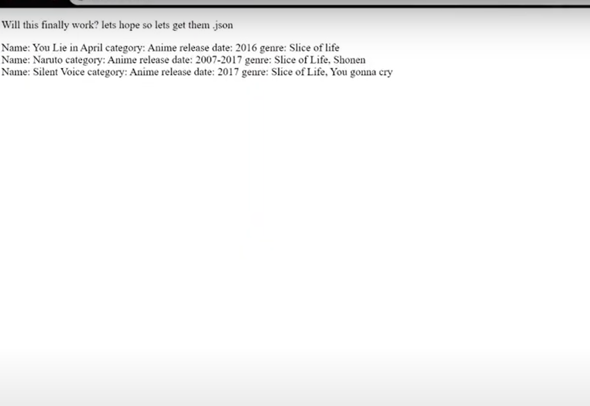
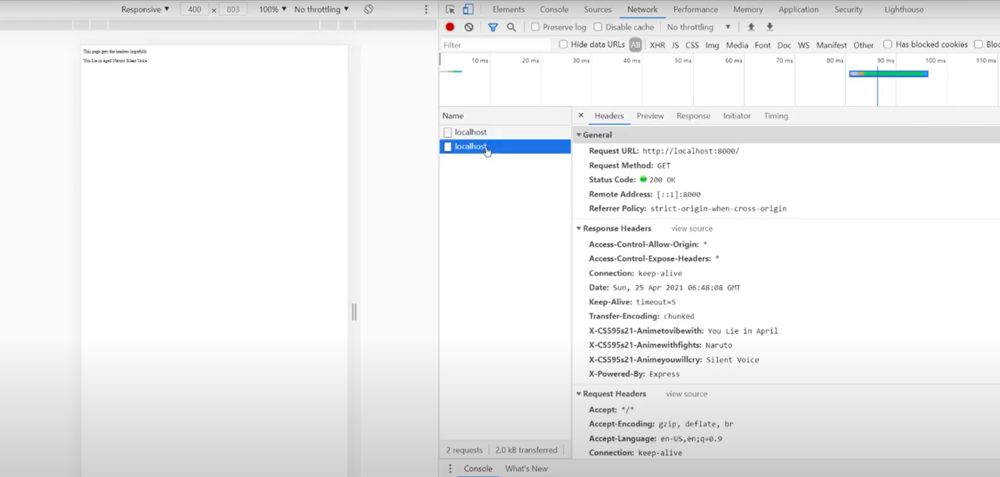
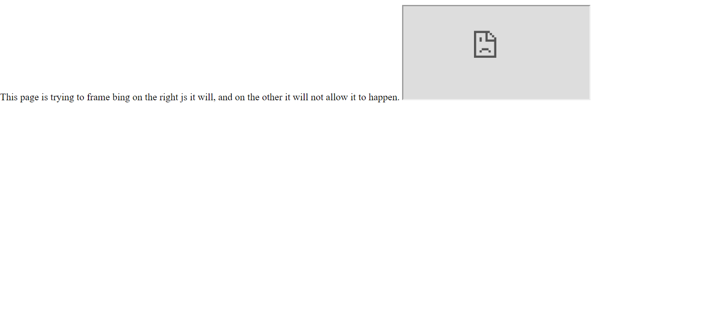

This is my assignment 5 submission the first video is for 5.1-5.2
https://www.youtube.com/watch?v=I5ed2Zu2gto

this video is for 5.3
https://youtu.be/xUV4cUukbsk

I accidently deleted it after I recorded the video
So if any of the files look a little off from the video 
that is why. I had trouble with express but I figured it out
Assignment 6 should be up soon

This screen shot shows the webpage getting the .json file 

This is a screen shot showing the cookies being accepted by the site for part 2

This screen shot is of the frame being blocked on part 3 

