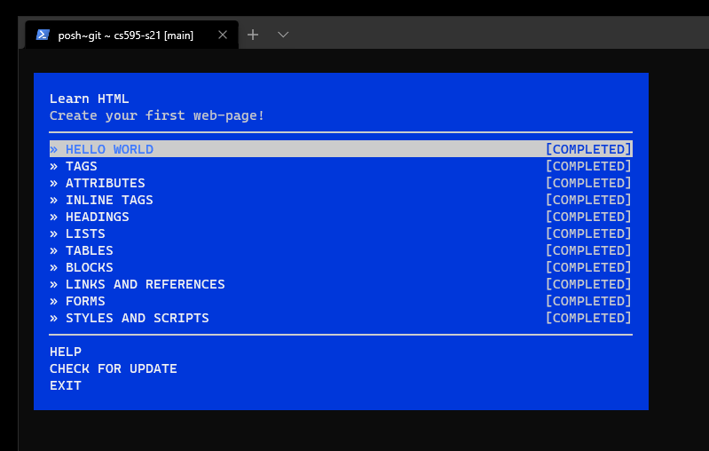
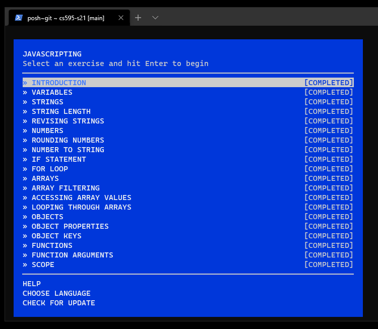
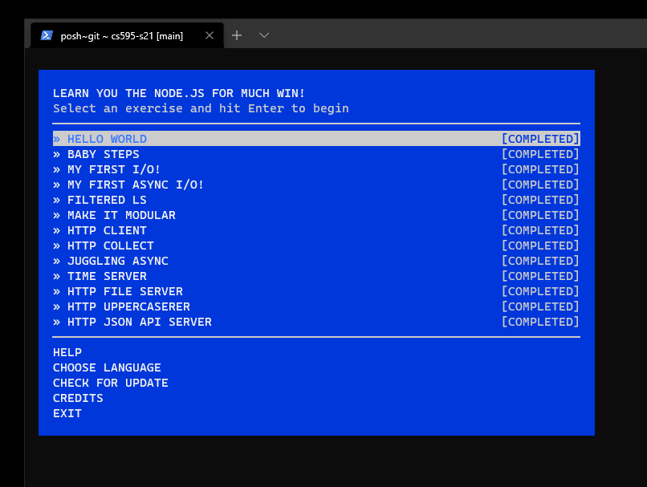

# CS 595 - Assignment 2 

Assignment 2 for CS 595 - Web Security at Old Dominion University.  Complete exercises found in the learnyouhtml, javascripting, and learnyounode npm packages.  

### Directory 

* \html - Directory containing all of the learnyouhtml exercises
* \javascript - Directory containing all of the javascripting exercises
* \node - Directory containing all of the learnyounode exercises
* .gitignore - Used to ignore unncessary node\node_modules directory

### Results

#### learnyouhtml

#### javascripting

#### learnyounode

### Technologies Used

* node.js - v15.5.1 - https://nodejs.org/en/

### YouTube Video

Demonstration video for this assignment can be seen here: https://youtu.be/EIHjy5UM5II