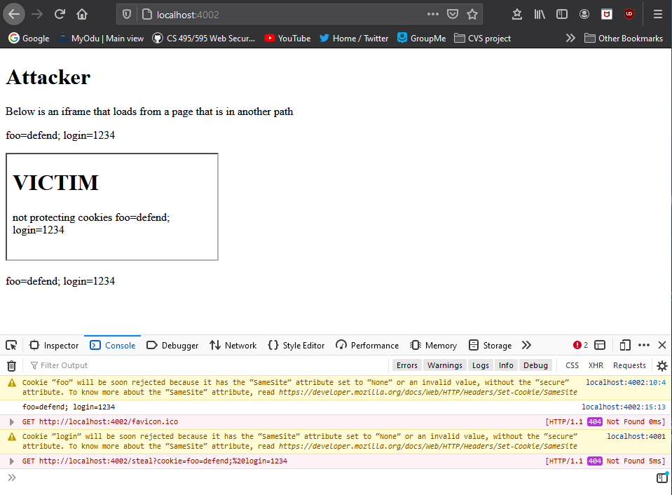
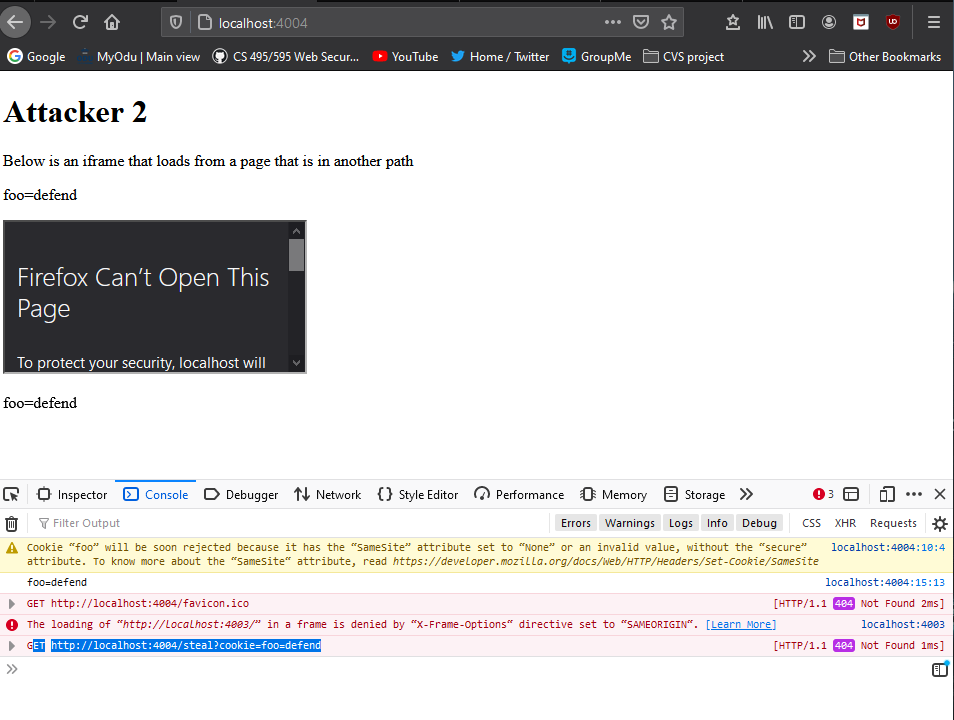

# Assignment 4

## Framable

After setting up a server on the local host I used html files to attempt to frame each websites.
When the site could not be framed I used the web developer tool to find the reason which was usually "set 'X-Frame-Options' to 'sameorigin'" or "set 'X-Frame-Options' to 'deny'".

| Website                    | Framable   | Reason |
| --- | --- | --- |
| addtoany.com               | yes        |
| adssettings.google.com     | no        | server ip address not found
| akamaihd.net               | no | server ip address not found
| allaboutcookies.org        | no        | set 'X-Frame-Options' to 'sameorigin'
| amazon.co.uk               | no        | set 'X-Frame-Options' to 'sameorigin'
| amazon.es                  | no        | set 'X-Frame-Options' to 'sameorigin'
| amazon.fr                  | no        | set 'X-Frame-Options' to 'sameorigin'
| amzn.to                    | no        | webpage may be down or moved
| asahi.com                  | yes        | 
| bbc.com                    | yes        | 
| berkeley.edu               | no      | refused to connect
| billboard.com              | yes        | 
| bloglovin.com              | yes        | 
| bp.blogspot.com            | no | server ip address not found 
| bp3.blogger.com            | no | server ip address not found  
| brandbucket.com            | yes        | 
| businessinsider.com        | no      | set 'X-Frame-Options' to 'sameorigin' 
| calameo.com                | no        | set 'X-Frame-Options' to 'sameorigin'
| cbsnews.com                | yes        | 
| cdc.gov                    | yes        | 
| cnet.com                   | no        | refused to connect
| com.com                    | yes        | 
| consumerreports.org        | yes         |
| creativecommons.org        | no        | set 'X-Frame-Options' to 'deny'
| dell.com                   | yes        | 
| dw.com                     | yes        | 
| ebay.com                   | no        | set 'X-Frame-Options' to 'sameorigin'
| engadget.com               | no         | set 'X-Frame-Options' to 'sameorigin' 
| entrepreneur.com           | no         | refused to connect
| espn.com                   | no         | refused to connect
| evernote.com               | no         | set 'X-Frame-Options' to 'sameorigin'
| facebook.com               | no        | set 'X-Frame-Options' to 'deny'
| fb.me                      | no        | set 'X-Frame-Options' to 'deny'
| feedburner.com             | no        | refused to connect
| feedburner.google.com      | no         | server IP address could not be found
| ggpht.com                  | no |           server IP address could not be found
| godaddy.com                | no       | refused to connect
| google.com.tw              | no         | refused to connect
| google.ru                  | no         | refused to connect
| hatena.ne.jp               | no        |  refused to connect
| hollywoodreporter.com      | yes        | 
| hp.com                     | no        | refused to connect
| ikea.com                   | no         | refused to connect 
| imgur.com                  | no         | refused to connect
| instructables.com          | no         | refused to connect
| iso.org                    | yes        | 
| istockphoto.com            | no         | refused to connect
| iubenda.com                | no         | refused to connect
| ja.wikipedia.org           | no         | server IP address could not be found
| kinja.com                  | no        | refused to connect 
| lemonde.fr                 | no         | refused to connect 
| linkedin.com               | no         | refused to connect
| lycos.com                  | no         | refused to connect 
| mail.google.com            | no         | refused to connect
| marketingplatform.google.com | no        | server IP address could not be found
| mashable.com               | yes        | 
| mediafire.com              | no         | refused to connect
| networkadvertising.org     | no         | set 'X-Frame-Options' to 'sameorigin'
| news.com.au                | yes        | 
| news.yahoo.com             | no         | refused to connect
| newsweek.com               | no         | set 'X-Frame-Options' to 'sameorigin'
| nih.gov                    | no         | set 'X-Frame-Options' to 'sameorigin'
| nikkei.com                 | yes        | 
| office.com                 | no         | set 'X-Frame-Options' to 'sameorigin'
| orange.fr                  | no         | set 'X-Frame-Options' to 'sameorigin' 
| ovh.net                    | no         | webpage may be down or moved 
| pastebin.com               | no         | set 'X-Frame-Options' to 'deny'
| paypal.com                 | no         | refused to connect
| people.com                 | yes        | 
| picasa.google.com          | no         | webpage may be down or moved
| picasaweb.google.com       | no         | server IP address could not be found
| playstation.com            | no         | set 'X-Frame-Options' to 'sameorigin'
| politico.com               | yes        | 
| rt.com                     | yes         | 
| sendspace.com              | no         | set 'X-Frame-Options' to 'sameorigin'
| sfgate.com                 | yes        | 
| standard.co.uk             | yes        | 
| statista.com               | no         | set 'X-Frame-Options' to 'sameorigin'
| storage.canalblog.com      | no         | server IP address could not be found
| tabelog.com                | no         |  set 'X-Frame-Options' to 'sameorigin'
| target.com                 | no         | refused to connect
| terra.com.br               | no         | set 'X-Frame-Options' to 'sameorigin'
| thoughtco.com              | no         | refused to connect
| tmz.com                    | no         | set 'X-Frame-Options' to 'sameorigin'
| tools.google.com           | no         | server IP address could not be found
| transandfiestas.ga         | no         | webpage may be down or moved
| tripadvisor.com            | yes        |
| uol.com.br                 | no         | refused to connect
| usatoday.com               | no         | set 'X-Frame-Options' to 'deny'
| vice.com                   | no         | refused to connect
| wa.me                      | no         | server IP address could not be found
| washingtonpost.com         | yes        | 
| whatsapp.com               | no         | set 'X-Frame-Options' to 'deny'
| who.int                    | no         | refused to connect
| wikia.com                  | no         | set 'X-Frame-Options' to 'sameorigin'
| wikihow.com                | no         | set 'X-Frame-Options' to 'sameorigin'
| xbox.com                   | no         | set 'X-Frame-Options' to 'deny'
| yale.edu                   | no         | set 'X-Frame-Options' to 'sameorigin'
| ziddu.com                  | yes        | 

## Frame-attack

**Successful Attack:** For this example used the victim and attacker servers and html. These set the cookie in the victim server and and had no protection. The attacker is able to embed the victim in an iframe and steal its cookies.

**Unsuccessful Attack:** In this example I used the secure and attacker2 servers and html. After clearing the browser cookies a cookie is set on the secure.html and x-frame-option is set to Sameorigin on the secure.js server. This means that attacker2 cannot embed secure in an iframe or steal its cookie.

## Youtube Videos 

**Framable video:** https://www.youtube.com/watch?v=JuQfHFRs0cY

**Frame-attack video:** https://www.youtube.com/watch?v=55TA6SOscuo