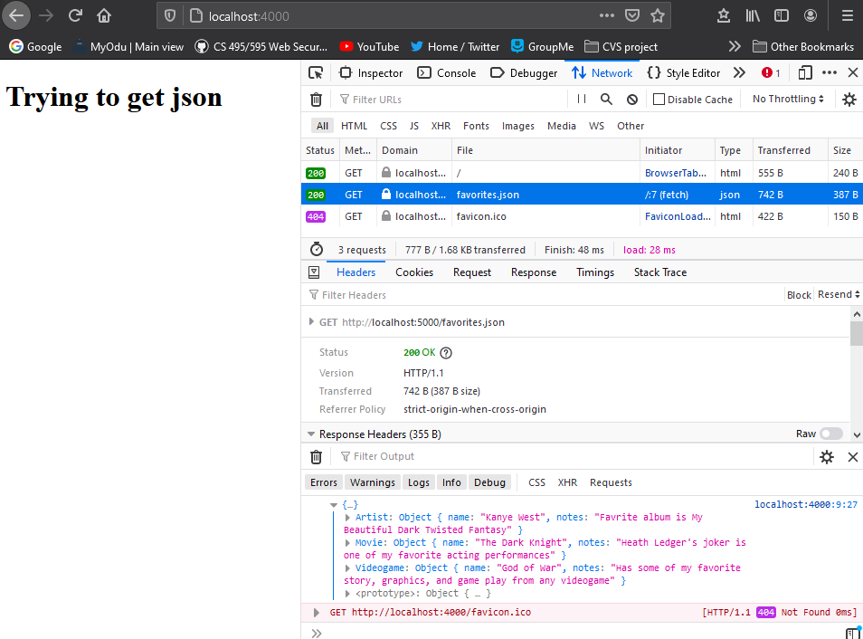
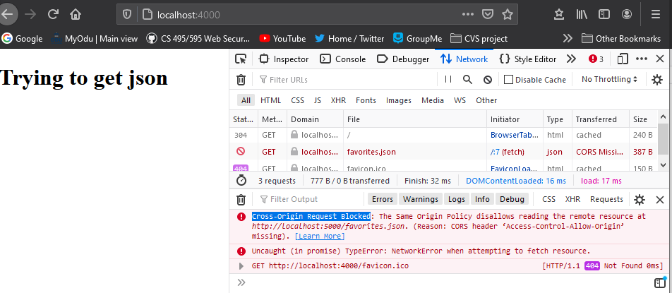
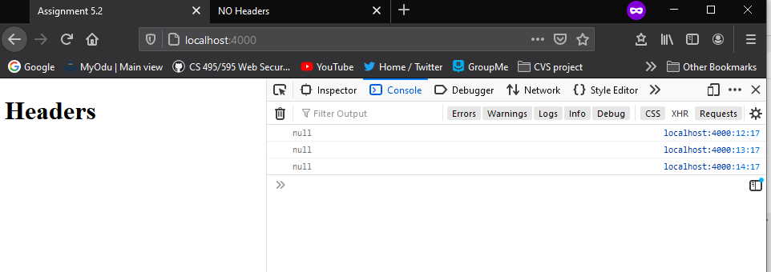
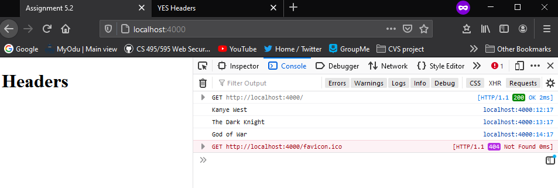
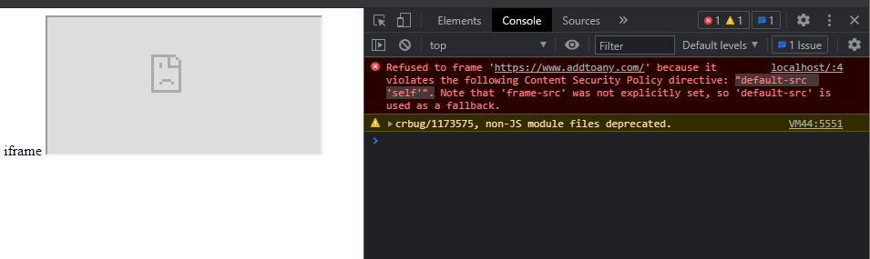
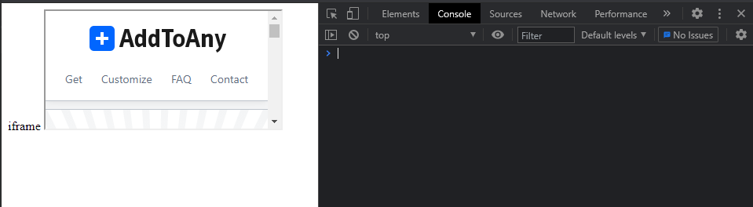

# Assignment 5

## 5.1
In this assignment three servers were set up. Server1 is set up on port 4000 and attempts to steal json information from server2 and server3 that are set up on port 5000. This is possible on server2 but not on server3 because server2 has the CORS having defined.

**With CORS defined:**

**Without CORS defined:**

## 5.2
This assignment uses three servers to try to access custom headers. Server1, running on port 4000, serves the html file that tries to steal the headers from port 5000. Server2 denies the header and server3 allows the headers, the difference being that server3 sets ('Access-Control-Expose-Headers', '*').

**No headers:**

**Yes headers:**

## 5.3
Two servers are used to serve an iframe html for adtoany.com on port 4000. Server1 denies the iframe by setting "default-src 'self'". Server2 allows the iframe by allowing anytoany.com.

**Denied iframe:**

**Allowed iframe:**

## Youtube Videos

**5.1 Video:** https://www.youtube.com/watch?v=sCTJjIVSyTk

**5.2 Video:** https://www.youtube.com/watch?v=sWgDHEIxq2g

**5.3 Video:** https://www.youtube.com/watch?v=Mj8Bfbndc7U
