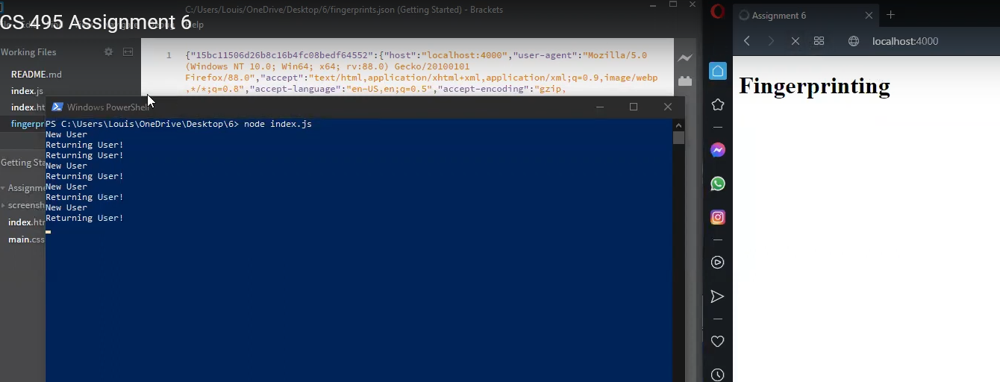
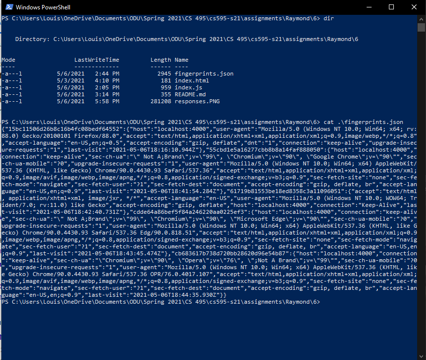

# Assignment 6

## Summary

In this assignment I ran a server on localhost:4000 that fingerprints individual browsers and writes them to a json file. The server also shows if the user is "New" or "Retuning". The five browsers used include Firefox, Chrome, Internet Explorer, Edge, and Opera.

**Video:** https://www.youtube.com/watch?v=IKEw4fIspzs

## Screenshots 

**New and Returning Responses**

**Fingerprints**

