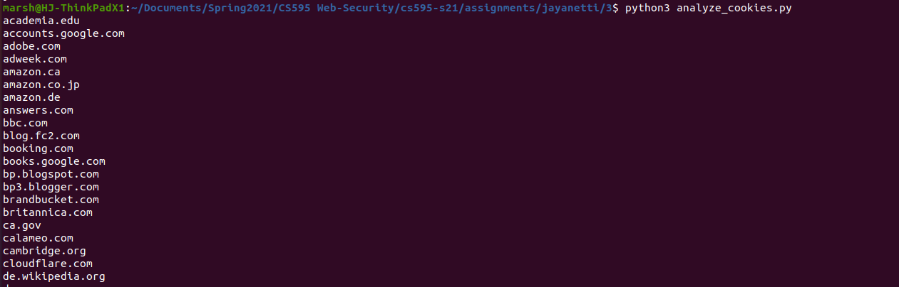
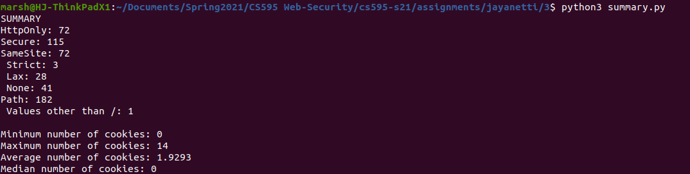

# Assignment 3: Cookie Report

## List of directories

  * [Data Table](data.tsv)
  * Code
    * [Collect CURL responses and dump JSON](analyze_cookies.py)
    * [Creat summary table with values](summary.py)
  * Intermediate Files
    * [CURL Responses](curl_output)
    * [JSON Output](out.json)

## Summary

### 

* HttpOnly: 72
* Secure: 115
* SameSite: 72
  * Strict: 3
  * Lax: 28
  * None: 41
* Path: 182
  * Values other than "/": 1

### Min/Max/Mean/Median 

* Minimum number of cookies: 0
* Maximum number of cookies: 14
* Average number of cookies: 1.9293
* Median number of cookies: 0

### Screenshots

* Collecting the data for each URL.

* Creating the summary table and reporting the summary.

