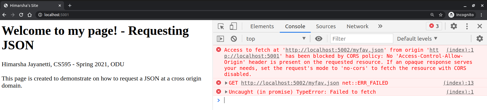
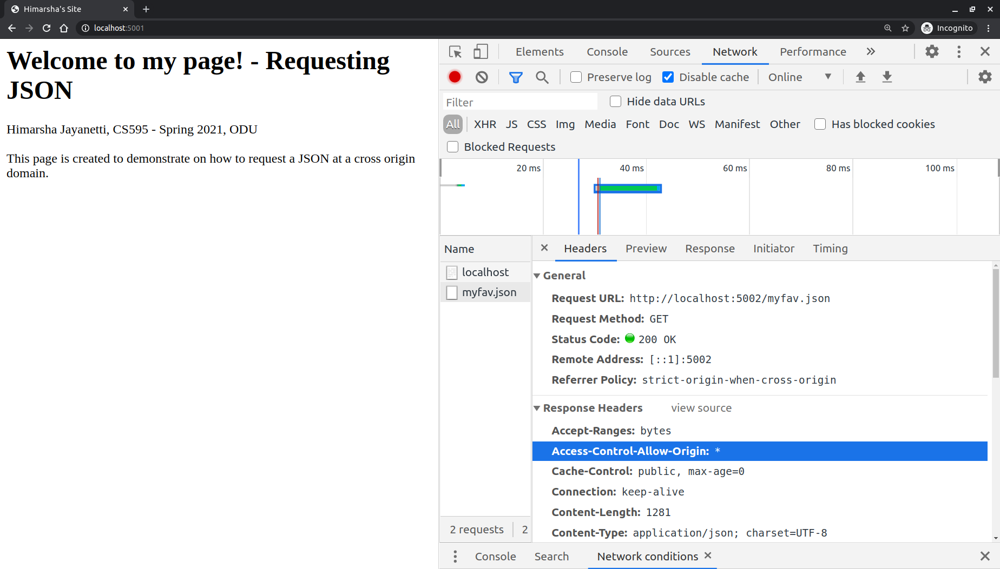
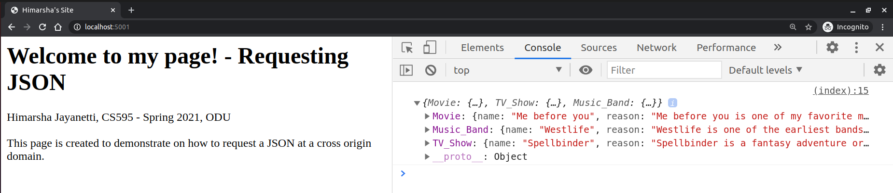
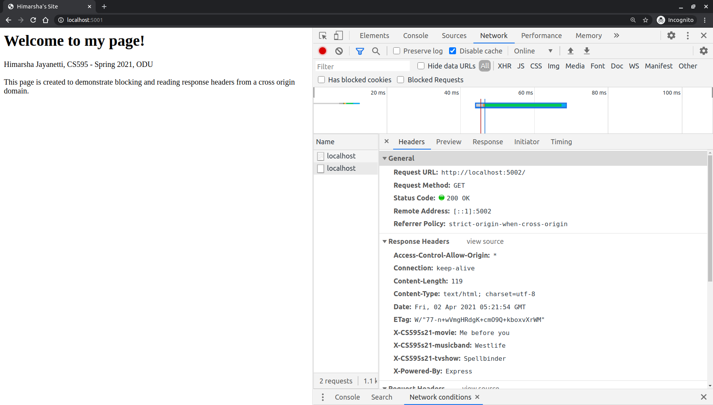
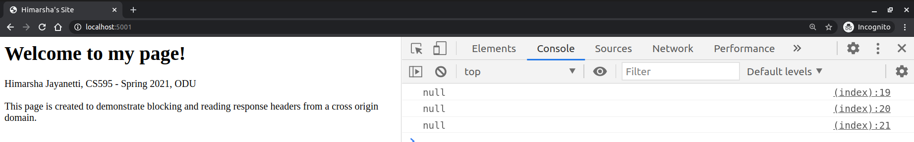
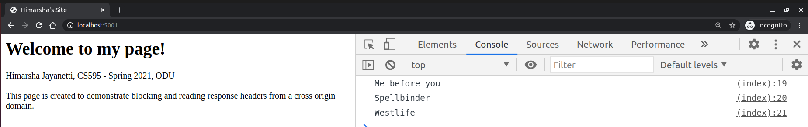
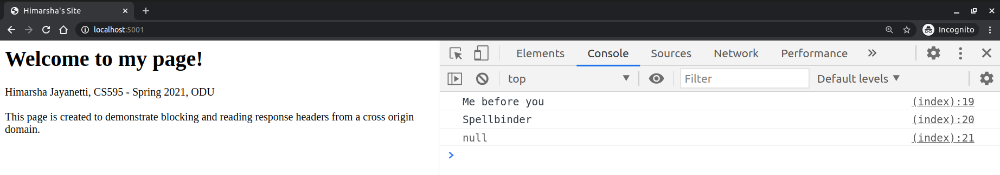
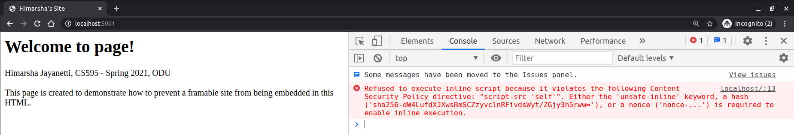
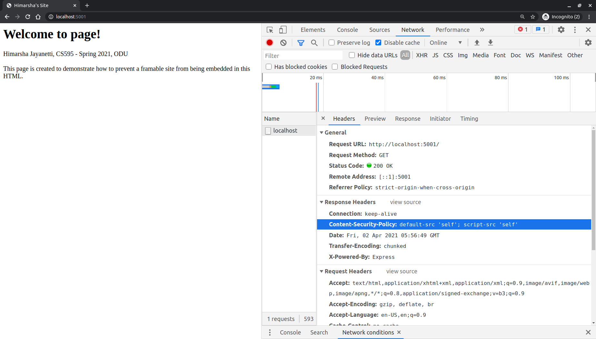
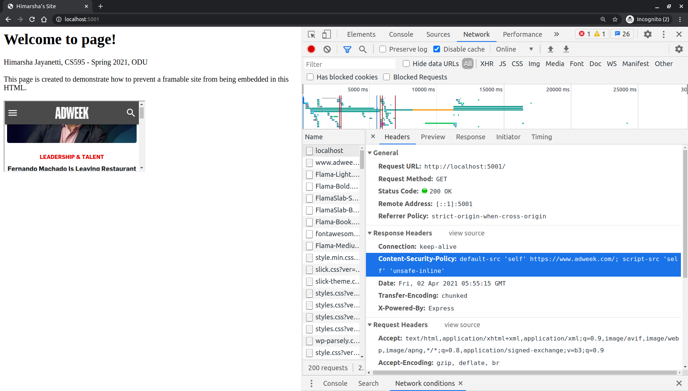

# Assignment 5: Same-origin Policy, CORS, CSP
#### Himarsha Jayanetti, CS 495/595 Web Security, Spring 2021

## List of directories

  * [Q1 files](5.1)
    * [Server 1: Hosting the HTML](5.1/server1.js)
    * [HTML file](5.1/files/1.html)
    * [Server 2: Hosting the JSON (Preventing access)](5.1/deny_server.js)
    * [Server 2: Hosting the JSON (Allowing access)](5.1/allow_server.js)
    * [JSON](5.1/files/myfav.json)
  * [Q2 files](5.2)
    * [Server 1: Hosting the HTML](5.2/server1.js)
    * [HTML file](5.2/files/1.html)
    * [Server 2: No access to response headers](5.2/deny_server.js)
    * [Server 2: Allowing access to response headers](5.2/allow_server.js)
  * [Q3 files](5.3)
    * [Server 1: Allowed embedding](5.3/allow_server.js)
    * [Server 2: Prohibiting embedding](5.3/deny_server.js)
    * [HTML file](5.3/files/my.html)
   
## Q1: CORS: Blocking and reading responses from another origin

### Youtube Video: https://youtu.be/atudQaQC9Q8

### Steps:
* In first instance, the javascript in HTML hosted on server 1 is unable to fetch the JSON hosted on server 2. This is because the CORS headers are not defined.
  Below response header should be set.
```
'Access-Control-Allow-Origin': * 
``` 
No 'Access-Control-Allow-Origin' in the response headers.


Console will show the issue.



* Later I am allowing the CORS headers in server 2 which will allow the JSON response to be shared with server 1. In order to achieve this, I am using the cors node package.

```
var cors = require('cors')
app.use(cors())
``` 

'Access-Control-Allow-Origin' header is set to '*' 



Console will display the JSON as well.


   
## Q2: CORS: Blocking and reading HTTP response headers from another origin

### Youtube Video: https://youtu.be/_Pcig0X52wI 

### Steps:
* Setting the custom response headers.
```
res.set('X-CS595s21-movie', 'Me before you')
res.set('X-CS595s21-tvshow', 'Spellbinder')
res.set('X-CS595s21-musicband', 'Westlife') 
```


* I am accessing the custom headers which were set by javascript in the HTML and displaying it on the console using console.log().

```javascript
<script>

fetch('http://localhost:5002/')
  .then(response => {
  var movie = response.headers.get("X-CS595s21-movie")
  var tvshow = response.headers.get("X-CS595s21-tvshow")
  var musicband = response.headers.get("X-CS595s21-musicband")
  console.log(movie)
  console.log(tvshow)
  console.log(musicband)
  })
</script>
```

* We are not able to read the custom headers, unless specified otherwise. 


* To allow reading the custom header values at cross origin below should be specified. This will expose the response headers. Here, * allows all headers all headers to be exposed.

```
'Access-Control-Expose-Headers', '*'
```


* We can specify which headers can be exposed by defining them one by one.

```
'Access-Control-Expose-Headers', 'X-CS595s21-movie, X-CS595s21-tvshow'
```

   
## Q3: Content-Security-Policy: embedding from another site

### Youtube Video: https://youtu.be/IsSNLmCl4RM

### Steps:

* Site which allows itself to be embedded: https://www.adweek.com/. This site is embedded in the HTML file using the below javascript.

```
<script>
    const iframe = document.createElement('iframe')
    iframe.src = 'https://www.adweek.com/'
    document.body.appendChild(iframe)
</script>
```

* Server is restricting a framable site to be embedded in the HTML file it hosts. This is done by setting the 'Content-Security-Policy' header. 
```
app.use(function (req, res, next) {
  res.setHeader(
    'Content-Security-Policy',
    "default-src 'self'; script-src 'self'"
  );
  next();
});
```




* Same way we can allow a site to be embedded by specifying it in the 'Content-Security-Policy' header. I am making changes to the default-src, script-src to achieve this. Additionaly, the 'unsafe-inline' is used since it is required to enable inline execution.

```
app.use(function (req, res, next) {
  res.setHeader(
    'Content-Security-Policy',
    "default-src 'self' https://www.adweek.com/; script-src 'self' 'unsafe-inline'"
  );
  next();
});
```


## References

1. https://developer.mozilla.org/en-US/docs/Web/HTTP/Headers/Access-Control-Allow-Origin
2. https://expressjs.com/en/resources/middleware/cors.html
3. https://fetch.spec.whatwg.org/#http-new-header-syntax
4. https://developer.mozilla.org/en-US/docs/Web/HTTP/CORS
5. https://developer.mozilla.org/en-US/docs/Web/HTTP/CSP
6. https://www.digitalocean.com/community/tutorials/how-to-secure-node-js-applications-with-a-content-security-policy

