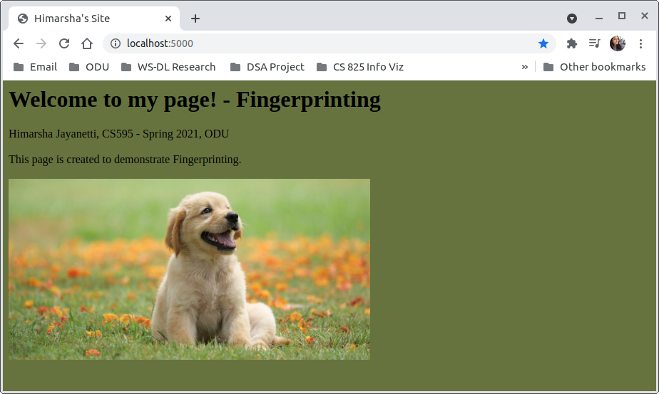
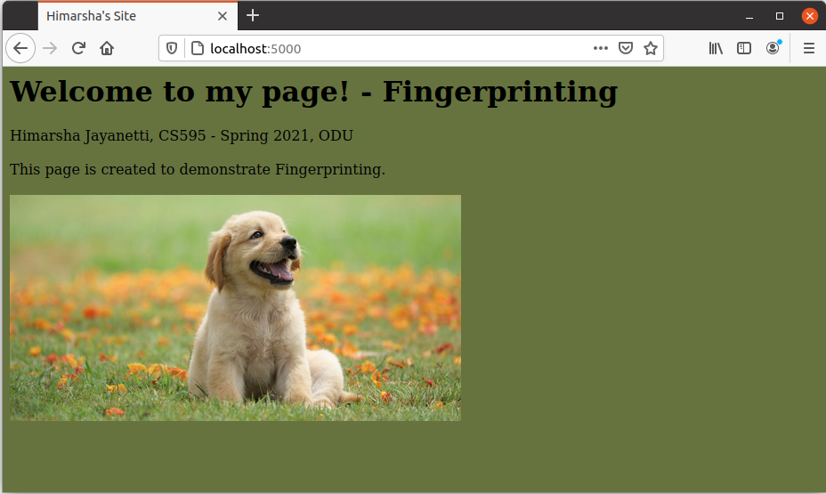
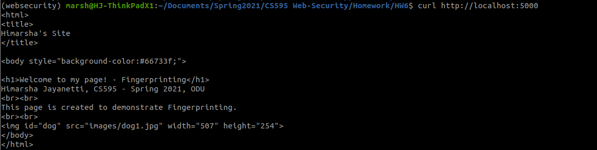
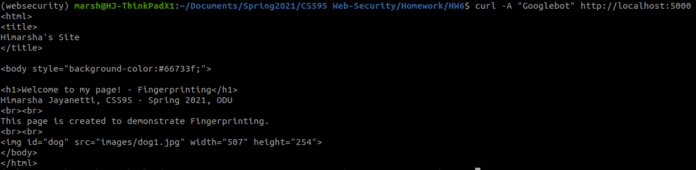

# Assignment 6: Fingerprinting
#### Himarsha Jayanetti, CS 495/595 Web Security, Spring 2021

## List of directories

  * [Server](server.js)
  
  * [Files](files)
    * [HTML file](files/1.html)
    * [Dog Image](files/images/dog1.jpg)   
    
  * [Screenshots](screenshots)
   
### Youtube Video: https://youtu.be/9sYszJtFVwY

### Steps:

#### Create the Server

1. Collecting the different features using [req.get](http://expressjs.com/en/api.html#req.get).
2. Concatenating them into a single string. 
3. Using the concatenated string to create the fingerprint ID. Here [md5](https://www.npmjs.com/package/md5) hashing is used.

```
//Collecting the features
feature1 = req.get('User-Agent')
feature2 = req.get('Accept')
feature3 = req.get('Accept-Language')
feature4 = req.get('Accept-Encoding')		

//Concat features to creat a string
var fingerprint = feature1.concat(feature2, feature3, feature4)

//Hashing the fingerprint string using MD5  
var fingerprint_id = md5(fingerprint)
```

4. Checking the access logs to see if the fingerprint ID already exists. 
5. If the fingerprint ID does not exist in log file, it means this is a new user who is accessing the HTML page.
6. Obtain the visitor information.
7. Log the visit with updated last visit count of 1.
8. Print a summary to the console.

```
{	    			
  //new user
  visitor = {}
  visitor['id'] = fingerprint_id
  visitor['user-agent'] = feature1
  visitor['accept'] = feature2
  visitor['accept-language'] = feature3
  visitor['accept-encoding'] = feature4
  visitor['visit-count'] = 1
  visitor['last-visit'] = new Date()
  log_line = (JSON.stringify(visitor)).concat('\n')
  
  //Logging the visit
  fs.appendFile('access.log', log_line, err => {
 if (err) {
   console.error(err)
   return
 }
 })

  console.log(`ID: ${fingerprint_id}, User: new`);	
}	
```

9. If the fingerprint ID already exists in log file, it means the user who is matching this profile has already visited the HTML page. 
10. Update the visitor profile with 
11. Log the visit with updated last visit count.
12. Print a summary to the console.

```
//checking if the fingerprint ID already exists in access log file
var found = array.find(a =>a.includes(fingerprint_id));

//if the fingerprint ID already in access log file
if (found) 
{

 //already visited
 for(i = array.length-1; i >= 0; i--) {
 const obj = JSON.parse(array[i])

 if(obj['id'] == fingerprint_id)
 {
  visitor = obj
  visitor['last-visit'] = new Date()
  visitor['visit-count'] = visitor['visit-count'] + 1
  log_line = (JSON.stringify(visitor)).concat('\n')
  //Logging this visit
  fs.appendFile('access.log', log_line, err => {
 if (err) {
   console.error(err)
   return
 }
 })
  //Printing a summary to the console 
  console.log(`ID: ${fingerprint_id}, User: existing, Previous-Visits:${visitor['visit-count']}`)
  return

 }

}}

```

#### Create the HTML file to be served

```
<html>
<title>
Himarsha's Site
</title>

<body style="background-color:#66733f;">

<h1>Welcome to my page! - Fingerprinting</h1>
Himarsha Jayanetti, CS595 - Spring 2021, ODU
<br><br>
This page is created to demonstrate Fingerprinting.
<br><br>

</body>
</html>
```

#### Test different browsers & devices

1. Google Chrome Browser (Device: Laptop)



2. Mozilla Firefox Browser (Device: Laptop)



3. CURL 



4. CURL with User-Agent set as "Googlebot" 



5. Safari Browser (Device: Mobile)


#### Log file

* Example log entry in the access log file

1. Laptop Browser

```
{"id":"df1eac9403a3dd73122ab4c8af536f5a","user-agent":"Mozilla/5.0 (X11; Ubuntu; Linux x86_64; rv:88.0) Gecko/20100101 Firefox/88.0","accept":"text/html,application/xhtml+xml,application/xml;q=0.9,image/webp,*/*;q=0.8","accept-language":"en-US,en;q=0.5","accept-encoding":"gzip, deflate","visit-count":1,"last-visit":"2021-05-02T16:34:41.987Z"}
```

2. Mobile Browser

```
{"id":"9670503c3bd04c74a8139050d7ec6402","user-agent":"Mozilla/5.0 (iPhone; CPU iPhone OS 14_4_2 like Mac OS X) AppleWebKit/605.1.15 (KHTML, like Gecko) Version/14.0.3 Mobile/15E148 Safari/604.1","accept":"text/html,application/xhtml+xml,application/xml;q=0.9,*/*;q=0.8","accept-language":"en-us","accept-encoding":"gzip, deflate","visit-count":1,"last-visit":"2021-05-02T16:37:09.453Z"}
```


